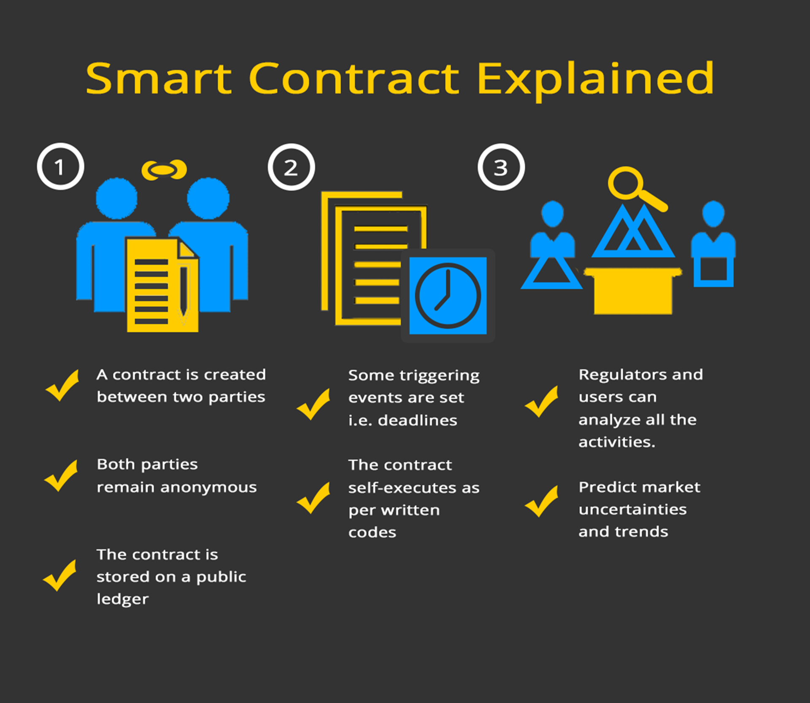
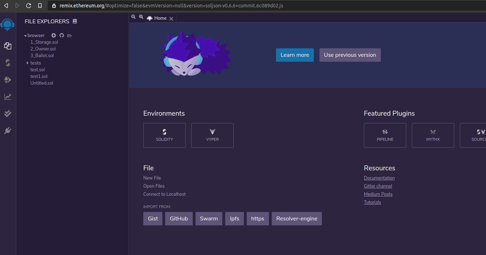
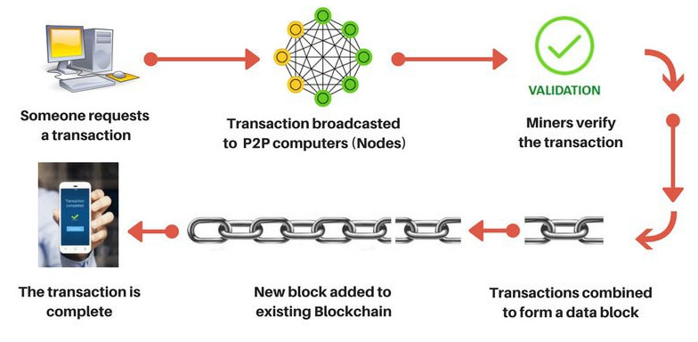
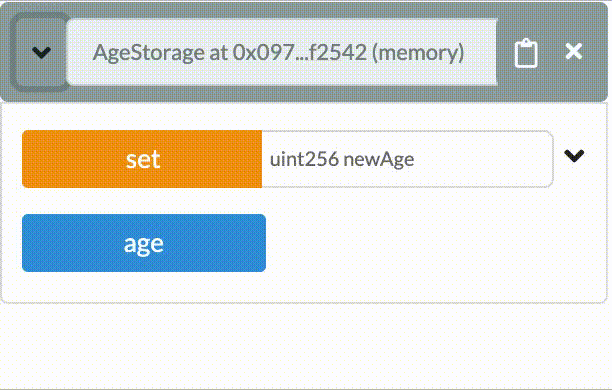
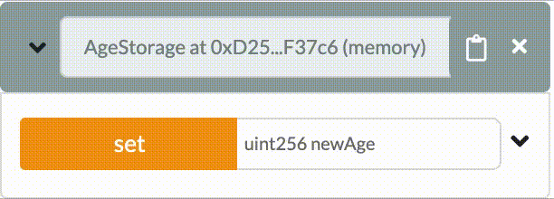
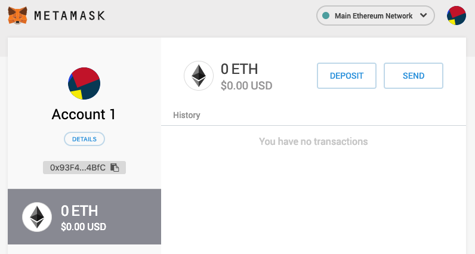
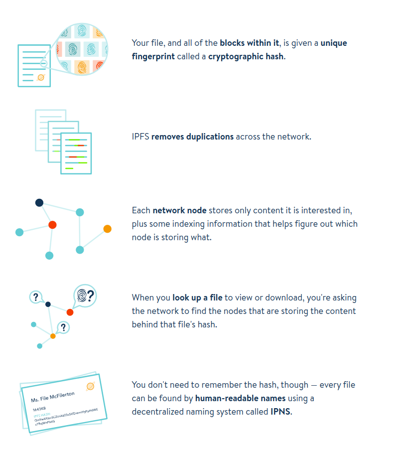

# Decentralized Development Course Manual

<!-- Table of Contents current as of 12-07-2020 13:40 -->
<!-- This overview was created to generate a pdf, is now commented to prevent errors / fixes in several places -->
<!-- ## Course Introduction

In this course you will learn about decentralized development hands on. Through a combination of theory and practical application you will learn how to program code that is deployed on a blockchain through smart contracts.

A basic knowledge about blockchain is assumed. Programming experience is not required.

At the end of this course you will have gained insight into the potential of smart contracts and several related blockchain subjects. You will be able to program smart contracts in Solidity and know about key concepts to make them work (see: [student goals](#student-goals)).

During the course we will use [CryptoZombies](https://cryptozombies.io/en/solidity) lessons 'Solidity Path: Beginner to Intermediate Smart Contracts'. Each week (with exception of week 1) we will discuss relevant concepts to the CryptoZobies lesson in class. These coding concepts will be explained using live coding examples in remix ide. In class more general concepts surrounding smart contracts will also be discussed.

All materials can be found on canvas. They include this course manual with a chapter for every week, the final assignment and the powerpoint slides.

## Grading

Your grade for this course will be determined by an assignment which you can find on canvas.

The assignment deadline is **deadline** and **insert handing in method**.

Whether you keep up with the CryptoZombie material will not be checked. CryptoZobie has a hit-system and you can check all the answers yourself. However we do strongly recommend following along with the Crypto lessons. Most of what you need to learn for your final assignment can be learned in those lessons.

## Student goals

After this course:

- The student is able to write Solidity smart contracts and knows how to use concepts like typed variables, functions, events, arrays & mapping, modifiers, etc.
- The student is able to describe security risks and precautions that can be taken with programming smart contract code.
- The student is able to use inheritance and interfaces and is able to describe the purpose of these concepts.
- The student is able to work with the Remix IDE. This includes writing, testing and deploying smart contracts from within Remix.
- The student is able to write and deploy Solidity smart contracts on the Ethereum (test) network.
- The student is able to connect the Remix IDE to Metamask and manage transactions via Metamask.
- The student is able to describe what Ethereum, Solidity, Remix IDE, MetaMask, InterPlanetary File System (IPFS) and Swarm are.

## Schedule

| Week | Topic                                             | CryptoZombie Lesson              | Date |
| ---- | ------------------------------------------------- | -------------------------------- | ---- |
| 1    | The Basics Of Smart Contracts                     | -                                | tbd  |
| 2    | Storage And Getting Into Functions                | 1 - Making The Zombie Factory    | tbd  |
| 3    | Interacting With Other Contracts And Transactions | 2 - Zombies Attack Their Victims | tbd  |
| 4    | Security And Saving Gas                           | 3 - Advanced Solidity Concepts   | tbd  |
| 5    | Wallets And Moving Money                          | 4 - Zombie Battle System         | tbd  |
| 6    | Tokens And Off-Chain Storage                      | 5 - ERC721 & Crypto-Collectibles | tbd  |
| 7    | Deploying Your Smart Contract                     | -                                | tbd  |
|      | Deadline Final Assignment                         |                                  | tbd  |

# The Basics Of Smart Contracts

## Decentralized Development

Development of applications generally consists of two parts, front-end development and back-end development. The front-end is what the user sees and interacts with, the back-end contains all the business logic and data storage.

> When you login to a website, the username/password form and the button with the function that sends the login information would be classified as 'front-end'. The website's logic of how to validate the information once it's received and what to send back is classified as 'back-end'. How the information that is send back is then presented (think success or error messaging) is part of the front-end.

Decentralized applications (or **dApps**) are applications whose back-end code runs on a decentralized network instead of centralized servers. These apps are not dependant on or controlled by a single entity. There is no single point of failure and trust can be generated through technology instead of middlemen or authority.

Although the term dApp is now almost always used to describe applications that make use of a blockchain network, this is not a necessity. Apps that use the BitTorrent protocol like Popcorn Time or uTorrent are also dApps, as they run on a decentralized p2p network.

Blockchain-based dApps are applications that communicate with a blockchain. The front-end works (largely) the same as with a centralized application but the business logic about what needs to happen with sent information is stored in the form of **smart contracts** on a blockchain. In this course we'll discuss the specifics that come with developing these types of decentralized applications and learn how to write smart contracts for real world use cases.

## Smart Contracts: The Basics

Smart contracts are basically digital contracts that automatically enforce their content. They can be used to replace complicated structures that we currently use to guarantee that an agreement is upheld.

Imagine you and a friend decide to bet on the outcome of a sports match. You think team A will win, your friend thinks team B will win. The loser has to pay up €100,-. If you and your friend completely trust each other you might just shake on it and leave it at that. However, what happens if you do not trust your friend to actually follow through and pay up the €100,- once team B (in your mind inevitably) loses? You might ask an impartial friend to function as a **trusted third party**. You could both give him €100,- to hand over €200,- to the winner once the match is over. Trust problem solved! Except it isn't. The trusted third party could turn out not to be as trustworthy as you hoped, be robbed or simply lose the money. Once you start worrying about this you might escalate the construction further, by involving a lawyer or a bank. Smart contracts fix the ever growing complexity of trust problems when agreements are made.

In a smart contract the rules for the agreement are written in executable code. Once the triggers for the agreement are activated, the consequences are immediately and automatically carried out. Because the smart contract is written in code that is publicly available on the blockchain there is **transparency** while the individuals involved can be **anonymous**. Because the smart contract cannot be changed once on the blockchain there is **immutability**. These factors combined with the fact that the blockchain itself cannot be altered by a central authority but is **distributed** eliminate the need for a trusted third party or middleman.

> In the example of your sports bet, you and your friend could write your agreement in the form of a smart contract on the Ethereum network. This smart contract could (for example) require €100,- from both of you to check the outcome online and route €200,- directly to the winner. Trust problem solved! This time for real.

Smart contracts have many practical uses. They can be made for any agreement that follows if-this-then-that logic. The more incentive anyone has to commit fraud, the more useful the smart contract becomes. For example think about the consequences implementing smart contracts would have for voting, financial services, renting a house, insurance cases, digital identity, trading etc. Because smart contracts can be used to create a transparent, immutable, decentralized and automated process they can also be very cost-effective as a result of their efficiency.

So smart contracts are pieces of executable code on a blockchain network. What does that mean? In the next section we'll examine where the code 'lives' and how the actual process of triggering the smart contract works.


[Smart Contract Explained]

## Ethereum: The Basics

Next time you and that friend you don't trust decide on a bet, you might want to try using a smart contract to handle the execution. But you would need a blockchain network to put it, to ensure it has all those great immutable, decentralized and transparent qualities you want. There are different options for what blockchain to use, including setting up your own, however currently for dApps the most widely used network is Ethereum.

If you visit ethereum.org you will find that _"Ethereum is a global, open-source platform for decentralized applications."_ You can use the established Ethereum network to put your smart contract and use existing nodes to validate and update information. Because a blockchain depends on the computational power of the network these nodes are rewarded for participating through digital currency. In the Ethereum network this currency is called Ether. In next weeks material we will go into more detail about how this actually works.

Smart contracts, once put on the Ethereum network have an address. This address is used to find the correct smart contract and send the required information. Just like an e-mail address (or regular address) is used to find the person you sent information to. The information that is sent to the smart contract is called a transaction.

## Solidity: The Basics

Solidity is a programming language for writing smart contracts on Ethereum and other blockchain platforms. It is what we'll be learning during this course. This material starts with the basics and works its way up. If at any point you want to try out some code at home or in class you can navigate to [Remix IDE](https://remix.ethereum.org/). Create a new file and give it a name to get started. Remix IDE allows you to write code in your browser, it gives you error messages and feedback about your smart contract code.



If you have never programmed before it can be intimidating to get started. Solidity has excellent [documentation](https://solidity.readthedocs.io/) but the documentation assumes you have some basic programming experience. In this course manual the main concepts will be explained for people completely new to programming, with references to the original documentation for additional information.

> DO go back and forward between this material and the CryptoZombies lesson, occasionally adding Google if something is unclear.

> DO NOT read through all of the documentation and expect to understand it completely and all at once before starting the CryptoZombies material.

### Basic Contract Structure

Below an example is given of a simple Solidity smart contract. Although this contract does not have a lot of practical value, it covers a lot of the core concepts of a contract written in Solidity. Let's go over it together.

```solidity
// compiler version
pragma solidity ^0.5.2;

// contract declaration
contract CookieStorage {
    // state variable of reference type int
    int private storeProfit;
    // state variable
    struct Cookie{
        string flavor;
        uint price;
        bool available;
    }

    // array
    Cookie[] public trayOfCookies;


    // function to add a cookie to the array
    function addCookie(string memory _flavor, uint _price, bool _available) public {
        Cookie memory c = Cookie(_flavor, _price, _available);
        trayOfCookies.push(c);
    }

    // function to get how many cookies are on the tray
    function getCookieCount() public view returns (uint _cookieCount){
        return trayOfCookies.length;
    }
}
```

### Comments

[Solidity Docs - Comments]

Comments are a great way to describe the meaning of code. The compiler will remove any comments during compilation, so it doesn't add anything to the code itself. It just helps the next person that is going to work on the contract, which probably will be you.

```solidity
// Single-line comment, everything on this line is a comment.

/*
Multi-line comment,
everything is a comment
until you end the comment
*/

uint age = 17; // Comments can also be written on lines with code

/*
This next line is also a comment, so no variable is declared
uint age = 17;
*/
```

#### Compiler Version

[Solidity Docs - Version Pragma]

The first line `pragma solidity ^0.4.0;` tells the compiler what version of the compiler must be used to compile the contract. A compiler is a computer program that transforms computer code written in one programming language (the source language) into another programming language (the target language). Ethereum smart contracts are run in the Ethereum Virtual Machine (EVM). The EVM doesn't understand Solidity code, it only understands EVM code. So to deploy our smart contracts to the Ethereum network we must first make sure to compile our Solidity code into EVM code.

This line **must** be included at the very top of every contract we'll be writing. Solidity is a relatively new language and is being developed heavily. This means the language changes quite a lot and the differences between versions are substantial. Therefore, please make sure the version you specify is the same as shown on the bottom left corner of the [Solidity Documentation]

```solidity
pragma solidity ^0.5.2;
```

#### Contract Declaration

To declare a contract we use the `contract` keyword followed by the name of the contract followed by two curly braces `{}`. This name can be anything you wish.

```solidity
contract CookieStorage {

}
```

> By convention the contract name is written in PascalCase. This means you capitalize every first letter of a word.

### Constructor (optional)

[Solidity Docs - Constructor]

Not every contract has a constructor. A constructor an optional special function that has the same name as the contract. It will get executed only one time, when the contract is first created. For now you can mostly forget about the constructor, it will come up later in more detail.

```solidity
pragma solidity ^0.5.2;

contract Cake {
  // state variable
  string flavor;

  // the constructor creates a cake the first time it is called
  constructor(string memory _flavor) public {
    flavor = _flavor;
  }

  // this function is not a constructor and therefore can be called more than once
  // more about functions later
  function setFlavor(string memory _flavor) public {
     flavor = _flavor;
  }

  // function that returns the flavor of the cake when called
  // more about functions later
  function getFlavor() public view returns (string memory _flavor) {
    return flavor;
  }
}
```

### Variables

In smart contracts we use variables to store and retrieve values. Take the `Cake` contract above for example. It declares a variable called `flavor` and uses the function `getFlavor()` to retrieve the flavor (more on functions later). The `CookieStorage` contract declared a variable called `Cookie` which consisted of several variables `flavor`, `price` and `available`.

> Variables can be stored in **storage** or in **memory**. In storage the variables are stored permanently on the blockchain, in memory the variables are temporary and are erased after use. More on this later.

Variables must be declared along with their 'type'. A type tells the EVM what kind of value we want to store and how much memory it should allocate. This could be an integer (a number without a decimal point), a string (a piece of text), an address (belonging to a human or contract) and more.

Variables are declared with the following structure: `<variable type> <variable name> = <variable value>`. See the example below, it tells the EVM we want to store a string (`string`) that we will call `flavor` and give it the value `chocolate`, and an integer (`int`) that we will call `price` and give it a value of `5`.

```solidity
string flavor = "chocolate";
int price = 5;
```

It is not required for values to be assigned a value on initialization. You can set the value at a later moment. This can be useful if you don't know the value at the moment of declaration.

```solidity
// this variable is declared here
string flavor;


function setFlavor() public {
    // and assigned a value here
    flavor = "chocolate";
}
```

> By convention a variable is written in camelCase. This means you capitalize every first letter of a word, except for the first word. Programmers use this to increase readability of variables. It is also recommended to keep your variable names short and descriptive. It might be tempting to name your variables x and y but other people won't be able to understand what's going on (and neither will you if you return to your code in a few months).

#### Value Types

[Solidity Docs - Types]

As mentioned before, we need to specify a type whenever we are declaring a variable. A type tells the EVM what kind of value we want to store and how much memory is needed to store it.

Let's go over a few common types.

##### Boolean

[Solidity Docs - Boolean]

The boolean type can be used to store exactly two kind of values, `true` and `false`. A boolean is indicated by the `bool` keyword.

```solidity
bool isDelicious = true;
bool hasChocolateChips = false;
bool available = true;
```

##### Integer

[Solidity Docs - Integer]

An integer is a 'whole' number that has no decimal point. There are multiple types of integers, but for now we focus on `signed` and `unsigned` integers. The most important difference between these is that `signed` integer types can hold positive and negative integer values, whereas `unsigned` integers can only hold positive integer values.

If we want to declare a variable for price it is logical to take make it an `unsigned` integer as a price can never be below 0.

```solidity
// Signed integer, can be positive and negative
int degreesCelsius = -5;

// Unsigned Integer, can only be positive
uint price = 5;
```

> Integers can also have specific sizes. The type uint256 is an unsigned integer that is 256 bits in size

##### String

[Solidity Docs - String]

The string type is used to store a piece of text. It can contain any value you like.

```solidity
string myText = "Hello World!";
string flavor = "vanilla";

// you can assign any character as a string by using double quotes.
string price = "1"
```

#### Reference Types

Reference types are special types where you have to explicitly mention where the type is stored when you use them in functions (more on this later). Storage (where state variables are stored, on the blockchain), memory (variables are only stored as long as the function call exists) or calldata (special location that we'll get into later).

##### Struct

[Solidity Docs - Struct]

Structs are for when you need to make your own type that groups multiple variables. The struct Cookie groups flavor, price and availability. After you have defined what the struct looks like you can create instances of the struct. To get one of the attributes from the struct you simply use `.<attribute>`.

```solidity
// struct cookie with attributes flavor, price and available.
struct Cookie{
    string flavor;
    uint price;
    bool available;
}

// create specific cookies
Cookie c1 = Cookie("oat", 2, true);
Cookie c2 = Cookie("double chocolate chip", 4, false);

// get specific cookie attributes
c1.available // returns true
c1.flavor // returns "oat"
c2.price // returns 4
```

##### Array

[Solidity Docs - Array]

An array is a collection/list of variables. With arrays several actions can be performed, like adding to the array or removing from the array.

The type of the array is the element type with hooks `[]` behind it. The `[]` signifies that the there is an array. If the array needs to be a fixed length it can be determined between those hooks.

```solidity
// struct
struct Gift {
    uint price;
    uint grams;
    string birthdayGreeting;
}

// array of structs;
Gift[] public gifts;

// create a new Gift
Gift christmasGift = Gift(90, 1100, "Merry Christmas");

// adding to the array of structs with push
gifts.push(christmasGift);

// getting the amount of items in the array with length
gifts.length()

// array of ints
int[] arrayOfInts;

// adding to the arrayOfInts with push
arrayOfInts.push(16);
arrayOfInts.push(2);
arrayOfInts.push(2009);
arrayOfInts.push(3);

// variable len is now the same as 4
int len = arrayOfInts.length()

// array of ints with fixed length 20
int[20] fixedArrayOfInts;
```

Each item in an array has an index value that specifies its location. The index always starts at `0`. So the first array item has index `0`, the second item has index `1`, the third item has index `2` etc.

```solidity
// array of ints
int[] arrayOfInts;

// adding to the arrayOfInts with push
arrayOfInts.push(16);
arrayOfInts.push(2);
arrayOfInts.push(2009);
arrayOfInts.push(3);

// how to get 2009 from the array
arrayOfInts[2]

// how to save 2009 in the variable year
uint year = arrayOfInts[2]
```

#### Operators

Operators are a way to manipulate variables. You know most of these already. They are the regular math operators:

- x + y
- x - y
- x \* y
- x / y

Two operators you might not know are **exponential** and **modulo**.

##### Exponential

The exponential operator calculates X to the power of Y. Although this is often written as X^Y in mathematics, the operator when coding is actually \*\*.

```solidity
// Using the exponential operator to calculate bacterial growth
uint startingBacteria = 100
uint hours = 3;

int bacteriaPopulation = startingBacteria ** hours
// the variable bacteriaPopulation has now been assigned the value of 100^3 = 1000000
```

##### Modulo

Modulo is the operator that calculates the remainder of a division. When you divide 14 by 12, the 12 fits once with 2 left over. 14 % 12 = 2. This operator is often used to determine if the result of a division is even.

```solidity
33 % 3 = 0 // no remainder
33 % 5 = 3 // some remainder
```

### Functions

Functions are what make things happen in smart contract code. Up until now we've been **declaring** variables, but not doing much with them. Functions to activate the code within them. In the example below the function gets a flavor a price and an availability as input, it creates a new cookie and it adds it to the list using .push().

Functions can be endlessly complicated. Next week we'll take a good look at them, for now its just important to note that it receives input and executes something based on that input.

```
    // state variable
    struct Cookie{
        string flavor;
        uint price;
        bool available;
    }

    // array
    Cookie[] public trayOfCookies;

    // function to add a cookie to the array
    function addCookie(string _flavor, uint _price, bool _available) public {
        // creating a new struct cookie (reference types like stuct need to explicitly mention memory, storage or calldata)
        Cookie memory c = Cookie(_flavor, _price, _available);

        // we've seen push() before
        trayOfCookies.push(c);
    }
```

### Basic Contract Structure

Look at the `CookieStorage` contract again. Hopefully you can understand what is happening in it a bit better than at the beginning of this weeks material.

```solidity
// compiler version
pragma solidity ^0.5.2;

// contract declaration
contract CookieStorage {
    // state variable of reference type int
    int private storeProfit;
    // state variable of reference type struct
    struct Cookie{
        string flavor;
        uint price;
        bool available;
    }

    // array of structs
    Cookie[] public trayOfCookies;


    // function to add a cookie to the array
    function addCookie(string memory _flavor, uint _price, bool _available) public {

        // a new struct
        Cookie memory c = Cookie(_flavor, _price, _available);

        // .push()
        trayOfCookies.push(c);
    }

    // function to get how many cookies are on the tray
    function getCookieCount() public view returns (uint _cookieCount){

        // .length()
        return trayOfCookies.length;
    }
}
```

## Additional reading / watching

[Smart Contracts by Simply Explained on YouTube]

[Get Started With Ethereum]

<!-- Internal links -->

[solidity documentation]: https://solidity.readthedocs.io/
[solidity docs - version pragma]: https://solidity.readthedocs.io/en/latest/layout-of-source-files.html#version-pragma
[solidity docs - types]: https://solidity.readthedocs.io/en/latest/types.html
[solidity docs - boolean]: https://solidity.readthedocs.io/en/latest/types.html#booleans
[solidity docs - integer]: https://solidity.readthedocs.io/en/latest/types.html#integers
[solidity docs - string]: https://solidity.readthedocs.io/en/latest/types.html#bytes-and-strings-as-arrays
[solidity docs - comments]: https://solidity.readthedocs.io/en/latest/layout-of-source-files.html#comments
[solidity docs - structs]: https://solidity.readthedocs.io/en/v0.5.3/structure-of-a-contract.html#struct-types
[solidity docs - constructor]: https://solidity.readthedocs.io/en/v0.5.3/contracts.html#constructors
[solidity docs - array]: https://solidity.readthedocs.io/en/v0.5.3/types.html#arrays
[smart contracts by simply explained on youtube]: https://www.youtube.com/watch?v=ZE2HxTmxfrI
[get started with ethereum]: https://ethereum.org/en/what-is-ethereum/
[smart contract explained]: https://quantummile.com/service/smart-contracts/

# Storage And Getting Into Functions

## Smart Contracts: Immutability

A lot of the benefits and challenges of smart contracts result from one key concept: **immutability**. Once the smart contract code is done and agreed on it can not be changed by any party involved (some ifs and buts for this will come up later in the material). The result of the code is therefore also unchangeable, the same input under the same conditions will result in the same output.

> A popular phrase that comes from immutability of smart contracts is **code is law**. Code is law implies that whatever is in the code will and should happen. There are varying extremes of this. Some developers believe that even if there is an unintended bug in the code, once it is deployed, code is law.

The main benefit of immutability however is that it guarantees trust. Sometimes critics of blockchain can be cynical about the implication that we live in a world where there is no trust between parties. Advocates of blockchain however, often feel that especially because the trust is guaranteed, it allows parties to work more closely together and frees valuable time and resources otherwise spent on complicated trust constructions. The other aspect that guarantees trust is the **transparency** involved. Every smart contract comes from a point of agreement about the rules of a process.

## Ethereum: Storage

Smart contracts are pieces of code that are deployed on a blockchain network and that automatically enforce their content.

Previously we briefly mentioned how contract code is stored on the Ethereum network. Smart contracts, once put on the Ethereum network have an address, which is used to find the correct smart contract and send the required information to.

When we say the code is stored on the network, we mean the code is stored on the blockchain. Messages are sent to the blockchain and responses are listened to from the blockchain. When a smart contract is deployed it is 'sent' to the blockchain within a message. The smart contract code includes storage of information. Transactions can change this information depending on the rules that are in the code.



[Transaction from ITNext](https://itnext.io/pulling-the-blockchain-apart-the-transaction-life-cycle-381b76842c6)

Generally blockchain solutions are bad at storing large quantities of data. You want to use blockchain to only store things that are necessary to store in an immutable way. Blockchain can be combined with other storage methods if there is a need to store large quantities of data (see week 6: off-chain storage).

## Solidity: The Basics

Lets take another look at the CookieStorage contract example.

```solidity
// compiler version
pragma solidity ^0.5.2;

// contract declaration
contract CookieStorage {
    // state variable of reference type int
    int private storeProfit;
    // state variable of reference type struct
    struct Cookie{
        string flavor;
        uint price;
        bool available;
    }

    // array of structs
    Cookie[] public trayOfCookies;

    // function to add a cookie to the array
    function addCookie(string memory _flavor, uint _price, bool _available) public {
        // creating a new struct
        Cookie memory c = Cookie(_flavor, _price, _available);
        // using .push() to add to the array
        trayOfCookies.push(c);
    }

    // function to get how many cookies are on the tray
    function getCookieCount() public view returns (uint _cookieCount){
        // using .length() for the length of the array
        return trayOfCookies.length;
    }
}
```

In week one we discussed the structure of the contract and we discussed variables, types and arrays. This week we're diving a bit deeper into actually making some changes, using **functions**.

### Functions

[Solidity Docs - Functions]

Functions are the executable units of code within a contract. Functions can be executed (or _called_) after which the code inside it will run.

A function is declared with the following syntax:

```solidity
function <functionName>(<parameters>) <visibility modifier> <other modifiers> <return variables> {
    <function code>
}
```

A function **must** always be declared inside a contract. It is not possible to declare a function outside of a contract. So the function should be defined between the curly brackets (`{}`) of the contract.

If we take the functions from `CookieStorage` contract as an example.

```solidity
function addCookie(string memory _flavor, uint _price, bool _available) public {
    Cookie memory c = Cookie(_flavor, _price, _available);
    trayOfCookies.push(c);
}

function getCookieCount() public view returns (uint _cookieCount){
    return trayOfCookies.length;
}
```

for the `addCookie()` function:

- **`addCookie`** is the **function name**
- **`string _flavor`, `uint _price` and `bool _available`** are the **function parameters**
- **`public`** is the **visibility modifier**
- the function has no **state modifier**
- the function has **no other modifiers**
- the function has **no return variables**
- **`Cookie memory c = Cookie(_flavor, _price, _available); trayOfCookies.push(c);`** is the **function code**

for the `getCookieCount()` function:

- **`getCookieCount`** is the **function name**
- the function has **no function parameters**
- **`public`** is the **visibility modifier**
- **`view`** is the **state modifier**
- the function has **no other modifiers**
- **`returns (uint _cookieCount)`** are the **return variables**
- **`return trayOfCookies.length;`** is the **function code**

So what do the `parameters`, `visibility`, `modifiers` and `return variables` actually mean? Let's go over all of them.

> By convention a function name is written in camelCase. This means you capitalize every first letter of a word, except for the first word.

#### Parameters

[Solidity Docs - Function Parameters]

Parameters are the input values of a function. Let's say we want to create a function that calculates the sum of two integer values. Parameters allow us to pass the two integer values to the function so the sum can be calculated (using the operator `+`).

In the example below two parameters, `val1` and `val2` are declared as parameters for the `sum` function. Parameters are declared the same way as variables, so every parameter should have a type. In this case `uint`.

Now whenever we want to execute the `sum` function, which we are going to do in later lessons, we are required to pass the two parameters to the `sum` function.

```solidity
function sum(uint _val1, uint _val2) public pure returns (uint) {
    return _val1 + _val2;
}
```

> You might have noticed that all the variables that are used inside of a function have an underscore before their name (\_val1). This is not necessary but a coding convention. Just like camelCase for a function name is convention. It serves to create more readable code for everyone.

The function `addCookie` from the CookieStorage contract takes parameters for flavor, price and availability. The function then uses these parameters within the function to create a new Cookie struct.

```solidity
//parameters are input for the function
function addCookie(string memory _flavor, uint _price, bool _available) public {

    // parameters are used in the function
    Cookie memory c = Cookie(_flavor, _price, _available);
    trayOfCookies.push(c);
}
```

#### Storage and memory

In week 1 we briefly mentioned that reference types (remember **structs** and **arrays**), when used in functions, need to explicitly say where they are stored. Any variable saved in storage is saved permanently on the blockchain, while anything saved in memory is saved temporarily and forgotten after the action that needs it is finished.

```solidity
function addCookie(string memory _flavor, uint _price, bool _available) public {

    // because the Cookie c is a temporary variable that does not need to be stored on the blockchain right now, it gets the memory keyword
    Cookie memory c = Cookie(_flavor, _price, _available);
    trayOfCookies.push(c);
}
```

You can also use the memory keyword with arrays, to create a new array inside a function without needing to write anything to storage. The array will then only exist until the end of the function call.

The way we can mostly tell the difference (for now) is that storage variables (state variables) are defined outside of functions, while memory variables are defined within functions.

```solidity
pragma solidity ^0.5.2;

contract Cake {
  // state variable gets saved in storage
  string flavor;

  function birthdayCandle(uint _age) public pure returns (uint){
      //the variables _year and _age are stored in memory, it is used and forgotten as soon as the function is over
      uint _year = 1;

      return _age + _year;

  }
}
```

Remember, because this example does not use reference types like `struct` or `array` storage and memory are implicit. If we did use reference types we would have to explicitly state storage or memory like in `addCookie()`.

#### Visibility Modifiers

[Solidity Docs - Visibility]

Function modifiers are used to modify the behavior of functions. They create additional features or make sure there are restrictions on a function. Visibility modifiers say something about the accessibility of the function when you or another function wants to interact with it (who is the function visible for).

```solidity
contract MyContract {

    function myFunction () [visibility-here] {
        // do something
    }

}
```

There are four types of visibility:

- `public`
- `private`
- `external`
- `internal`

At the moment we'll handle public and private visibility. Internal and external visibility can be found in next weeks material.

##### Public

Public functions and state variables are the most open visibility type. The function and variable can be accessed from inside and outside of the contract. It is important to be careful with public functions, as they allow anyone to call the function.

For public state variables, an automatic **getter function** is generated. A getter function is a function that simply returns the value of a variable. For the public `age` variable in the example below an `age()` function is generated that will return the value of `age`. This way we don't have to define the function to get the value of `age` ourselves.

```solidity
pragma solidity ^0.5.2;

contract AgeStorage {
    uint public age;

    // We don't have to define a function to get the value for because it is automatically generated. We know its name is age()

    function setAge(uint _newAge) public {
        age = _newAge;
    }
}
```



In the `CookieStorage` contract everything is public and can be accessed from inside and outside of the contract except for the variable storeProfit.

##### Private

Private is the most closed visibility type. Functions or variables with this visibility can only be accessed from other functions inside of the contract. It is generally recommended to keep functions private unless more visibility is needed.

```solidity
contract AgeStorage {

    // age can only be accessed from within the AgeStorage contract
    uint private age;

    // age can not be set from outside of the contract, only internally in the smart contract code
    function set(uint _newAge) private {
        age = _newAge;
    }

}
```


In the `CookieStorage` contract the variable storeProfit is private. It cannot be accessed by functions outside of the contract. So other smart contracts cannot check the store profit. In the `CookieStorage` contract there is (at the moment) no way to set or get the storeProfit. The variable is pretty useless without interaction within the code.

#### Return Variables

[Solidity Docs - Return Variables]

Functions can be used to execute an operation without changing anything. However functions are often used to return some information through return variables. The function needs to announce beforehand that it returns something as well as the type of what it returns. The function will then return what comes after the **return** keyword.

```solidity
contract MyContract {

    // this function returns a uint
    function doubleTheAge(int age) private returns (uint){
        return age * 2
    }

}
```

#### State Modifiers

[Solidity Docs - Function Modifiers]

Function modifiers are used to modify the behavior of functions. They create additional features or make sure there are restrictions on a function. State modifiers say something about how the function interacts with the blockchain.

##### Pure

[Solidity Docs - Pure Functions]

Sometimes a function does not change any data or even use any data from the contract. For example if you have written a function to add two numbers that you give it as parameters and return the result. This is called a **pure** function.

```solidity
function sum(uint _val1, uint _val2) public pure returns (uint) {
    return _val1 + _val2;
}
```

##### View

[Solidity Docs - View Functions]

If the function does not change anything, but does read data from the contract, it is a **view** function. The function is read only.

```solidity
uint age = 17;

function doubleTheAge() public view returns (uint) {
    return age * 2;
}
```

Or in our `CookieStorage` example.

```solidity
// function to get how many cookies are on the tray
function getCookieCount() public view returns (uint _cookieCount){
    // using .length() for the length of the array
    return trayOfCookies.length;
}
```

### Events

[Solidity Docs - Events]

Everything that we have been coding so far in solidity has been 'back-end' material. The smart contract lives on the blockchain and that is where all the code is executed and stored. However, if you are building an app for people to use it will need to have a frontend.

Events are the way the frontend is notified for things that are happening in the smart contract. Events are 'fired' in the back-end code and can be 'listened' for in the front-end code. This is how communication between the two works.

```solidity

   // create the event
   event CookiesDone(Cookie typeOfCookie, uint amount);

   function bakingCookie(Cookie typeOfCookie) public {

       uint roomInOven = 100
        // baking timer code
        // fire the event
          emit CookiesDone(typeOfCookie, roomInOven);

}
```

## Additional reading / watching

[Blockchain Transactions in Depth](https://itnext.io/pulling-the-blockchain-apart-the-transaction-life-cycle-381b76842c6)

<!-- Internal Links -->

[solidity docs - functions]: https://solidity.readthedocs.io/en/latest/contracts.html#functions
[solidity docs - function parameters]: https://solidity.readthedocs.io/en/latest/contracts.html#function-parameters
[solidity docs - return variables]: https://solidity.readthedocs.io/en/latest/contracts.html#return-variables
[solidity docs - visibility]: https://solidity.readthedocs.io/en/latest/contracts.html#visibility-and-getters
[solidity docs - function modifiers]: https://solidity.readthedocs.io/en/latest/contracts.html#function-modifiers
[solidity docs - view functions]: https://solidity.readthedocs.io/en/latest/contracts.html#view-functions
[solidity docs - pure functions]: https://solidity.readthedocs.io/en/latest/contracts.html#pure-functions
[solidity docs - events]: https://solidity.readthedocs.io/en/develop/contracts.html#events

# Interacting With Other Contracts And Transactions

## Ethereum: Accounts, Gas And Ether

A smart contract is a piece of code running on a blockchain network. The code contains variables and functions to allow it to execute its predetermined goal. Once the smart contract is deployed the code cannot change, this is called **immutability**, the only way to change a smart contract is to deploy a new one.

Once on the blockchain network the contract has an address. When the smart contract was created it received its own 'account' on the Ethereum network. Smart contracts own themselves. Unless specified within the code, smart contract creators have no special rights or control over the smart contract once it is created. People can also have accounts on the Ethereum network, including an address they use to identify themselves. These accounts are called Externally owned accounts (EOA's). EOA's are owned and controlled by users through wallet applications.

> Smart contracts are not controlled by anyone, they control themselves.

Every time someone wants to use a smart contract they need to use their address to send a message with what they want to do to the address of the smart contract. This is called a **transaction**. The smart contract does not run unless it is called by a transaction from a user. A smart contract is never 'running in the background' like other applications sometimes are. They are activated either by a transaction or by another smart contract, execute their purpose and are finished until activated again.

Every operation in Ethereum has some amount of computational cost/effort. Storing a value in a variable, adding a Zombie to your Zombie array etc. The effort to execute the operation is made by miners. Miners verify the transactions and make sure they are stored on the blockchain. The security and speed of a blockchain is dependent on the amount of miners that are willing to make the computational effort to secure it. This amount of effort is measured in **Gas**. Gas is a unit for the amount of computational effort that it will take to execute a desired operation. The bigger the operation, the more Gas it will take. Just like a car needs a certain amount of gas to get from point A to point B. The amount of Gas an operation takes can be found in gas pricing tables online.

Miners do not make the effort (measured in amount of Gas) just to participate in the fun of blockchain. Just like you do not constantly fill up your friends cars with gas just because you want to help them go on trips. Miners get rewarded for the gas they use up on operations in Ether. Ether is the cryptocurrency of the Ethereum network. The relation between Gas and Ether actually gets a bit more complicated (Ether can be turned into Gas directly) we advise you to consult the web if you want to know more specifics. Ether is also sometimes measured in Wei. One Ether is the same as 1,000,000,000,000,000,000 Wei. Some functions use Wei as a unit instead of Ether.

> Gas is the amount of effort that it will take to execute an operation, it is the cost of operations. Ether is a currency, it has value separate from the Ethereum network, it can pay the cost of operations. Wei is the smallest unit of Ether (10^18 Wei = 1 Ether) and is sometimes used in functions.

So to execute a smart contract, or a part of it, there needs to be a **transaction** that is sent to the smart contract's address to start it, and there needs to be payment included in this transaction. Externally owned accounts (EOAs) have their own ether balance and are able to send transactions. The transaction needs to specify what it wants to happen. So if you want to set the age variable from 17 to 21 the transaction needs to include that it wants the smart contract on address X to execute the setAge function with the data variable 21 and it needs to include the gas that the smart contract will need to execute that specific operation. The smart contract then receives the transaction and uses the gas to activate the specific function.


This is how interaction happens with smart contracts. If there is no activation, the smart contract code would simply sit idle without ever executing. Once the 'first' smart contract is activated by a transaction from an EOA, it can then activate different smart contracts to execute the desired operation.

> The code in smart contracts is activated by transactions or by calls from other smart contracts.

There are some simple contracts that can fit all their logic into one contract. To make more complex constructions however, while keeping the code clear and legible, the code is often split up into multiple contracts that interact with each other in some way.

## Solidity: Interaction With Other Contracts And Blockchain

There exists a world outside of your smart contracts code. This week we'll discuss several ways to interact with it.

### Special variables

[Solidity Docs - Special Variables]

In the smart contract code it is sometimes necessary to know information about the blockchain or the activating call. This information can be retrieved through special variables that are always available (global) to the smart contract.

#### msg.data

The special variable msg.data returns the complete data of the call that activated the function. It returns the data as type bytes.

#### msg.sender

The special variable msg.sender returns the address of the EOA or smart contract that called the current function. It returns the address as type address.

#### tx.gasprice

The special variable tx.gasprice returns the gas price of the transaction that activated the function. It returns the gas price as type uint.

#### gasleft

The special variable gasleft returns the remaining gas. It returns the remaining gas as type uint.

### Types

Last week we discussed how to use the Boolean, Integer, String, Struct and Array types. This week we're adding address and mapping types.

#### Address

[Solidity Docs - Address]

The address type is used to store an ethereum account address. Although Ethereum has two types of accounts (EOA's and smart contract accounts) the addresses are both type address. Address is a value type, like boolean, string or int.

The size of an Ethereum address is 20 byte.

```solidity
address myAddress = 0x2bE37643B3Ecb05c4C2Ec646534b3f053565716A;
```

#### Mapping

[Solidity Docs - Mapping]

Mappings create a mapping between a **key** and a **value**. They are often used to associate an ethereum address with a value that needs to be stored. Mappings can _only_ be saved in **storage** never in **memory**.

Just like with public state variables, declaring a public mapping automatically creates a **getter** function that can be used to retrieve from the mapping.

```solidity
pragma solidity ^0.5.0;

contract SomeGame {
    // creating a mapping between user address and user level
    mapping(address => uint) public userLevel;

    function currentLevel(address _userAddress) public view returns (uint) {
    // returning the user level that belongs to the given user address
    // using the generated getter for the mapping
     return userLevel[_userAddress];
}
}
```

### Functions

In previous material the basic components of functions were explained. In this week some new concepts surrounding functions are explored.

#### Multiple return variables

A function can execute an operation and optionally return a value when called through using the **returns** keyword. In Solidity a function can also have multiple return variables.

#### If-Else statements

An if-else statement is a general coding principle that is used to implement conditional logic. It is used most often within functions. It can also be used without the else statement or chain multiple if-else conditions.

```solidity
function buyDessert(int _age) public {
    if (_age < 12) {
        buyCupcake();
    }else {
        buyCake();
    }
}
```

Between the hooks `()` the if statement is made. If this statement is true, the action will execute. If it is not true, the else action will execute. The code execute top to bottom, so it tries the first option and then continues. If one of the statements is true, the function will not try the other options.

```solidity
pragma solidity ^0.5.0;

contract CookieStorage {
    // define state variable string
    string chosenFlavor;

    // define struct Cookie
    struct Cookie{
        string flavor;
        uint price;
        bool available;
    }

    // create specific cookies
    Cookie c1 = Cookie("oat", 2, true);
    Cookie c2 = Cookie("double chocolate chip", 4, false);

    function chooseCookie() public {
        // use the available attribute to check availability (if statement)
        if (c1.available == true){ // c1 is available so this is true
            chosenFlavor = c1.flavor; // this code executes
        }else {
            chosenFlavor = c1.flavor; // this code never happens
        }
    }
}
```

> The difference between = and ==. A single equals sign **assigns** a value. A double equals sign **checks** if the statement is true.

#### For loops

For loops are another general coding principle. They are used to execute something in a loop. They can be very simple or complex depending on desired functionality. For loops often use a counter, which can look complicated at first.

A for loop has a beginning, a condition and an incrementing step in the form of: `for (beginning; condition; step)`. The beginning is where to begin with counting, often this is initialized at 0 with `uint i=0`. The condition is what the function checks each step. If it is true the loop continues. For example `for(uint i=0; i < 10; step)` will continue as long as the condition `i < 10` (i is smaller then 10) is true. The increment is how we change the beginning each time. If we want i to increase with 1 every loop (until the condition is no longer true) we make the increment `i++`. A for loop that loops 9 times therefore looks like this `for(uint i=0; i <10; i++)`.

```solidity
// array of ages
uint[] public ages;

// length of the array
uint arrayLength = addressIndices.length;

// the information behind the for is the counter
for (uint i=0; i<arrayLength, i++){
    // dosomething as much times as the array is long
}

for (uint i=0; i < 100; i++){
    // dosomething until i < 100 is no longer true
}
```

#### Require

The require function is a function that checks certain requirements to be met before allowing the code to execute. It is used often within functions. In the case of a betting contract for example there might be a requirement that all participants are part of an agreed upon array of participants. Or that everyone has enough money to bet. Using require, the function will not execute further if the requirement doesn't pass.

```solidity
// in function that should only be activated by the owner address

require(msg.sender == owner)
```

```solidity
// in function that should only be activated by participants

require(bettingParticipants[msg.sender]);
```

### Inheritance

[Solidity Docs - Inheritance]

Why reinvent the wheel? It is good practice to reuse code instead of retyping it in every contract. One of the ways you can do this is through inheritance.

Inheritance is a coding principle that is not specific to blockchain, ethereum or solidity, however in this section we will discuss it in the context of solidity smart contracts. First a parent contract is created with variables and functions. Then a child contract is created which can inherit aspects of the parent contract.The child can access the functionality of the parent without having to redefine the same functions. Inheritance can help you with keeping the code organized and legible.

```solidity

contract Cake {
  // state variable
  string flavor;
  bool decoration;

  constructor() public {
      flavor = "chocolate";
      decoration = false;
   }

  function setFlavor(string memory _flavor) public {
     flavor = _flavor;
  }

  function setDecoration(bool _decoration_) public {
     flavor = _decoration;
  }
}

```

```solidity
import "./cake.sol";

contract CupCake is Cake {

// TODO
}
```

When there are multiple smart contracts (like the parent and the child) these each have their own .sol file. When there are multiple files of code that need to know about each other this is done by importing the code from one smart contract into the other. This is what the `import "./cake.sol";` line does in the previous example.

> Inheritance can be at its most useful when inheriting from contracts previously defined by other programmers. There are a lot of contracts out there that already offer functions you want in your code.

#### Visibility Modifiers

We already discussed private and public visibility. Once we are using inheritance and interacting with other contracts there are other types of visibility that become important. Internal and external visibility.

##### Internal

Previously, with the private visibility modifier, a function or variable can only be called from within the contract it is defined in. With internal visibility it can be called from the contract it is defined in **and** contracts that inherit it.

```solidity
contract AgeStorage {
    uint internal age;

    function set(uint newAge) internal {
        age = newAge;
    }
}
```


##### External

A function with external visibility can only be called from a separate third party contract. It can not be called from the contract it is defined in and it is can not be called from contracts that inherit the contract it is defined in.

```solidity
contract AgeStorage {
    // Not allowed
    // uint external age;

    function set(uint newAge) external {
    }
}
```



### Interface

[Solidity Docs - Interfaces]

One place the external visibility is relevant is in interfaces. An interface looks like a smart contract with no details, just the basic structure. There are no implemented functions and no assigned variables.

Interfaces make it possible to communicate with another existing contract on the blockchain. They create a bridge between contracts. By making an interface for a contract your code will know what functions that contract has, what to send to them and what to expect back.

```solidity
pragma solidity ^0.5.0;

//contract that we want to access
contract Level{

    // mapping of user addresses to their levels
    mapping(address => uint) userLevels;

    // function to get the level from a user
    function getUserLevel(address _userAddress) public view returns (uint) {
        return userLevels[_userAddress];
    }

}
```

```solidity
pragma solidity ^0.5.0;

// our interface
interface LevelInterface {
    function getUserLevel(address _userAddress) external view returns (uint);
}
```

```solidity
pragma solidity ^0.5.0;

// using our interface
contract MyGameExtension {

    // instance of the interface, more about this later
    LevelInterface levelInterface;

    function deservesReward() public {
        // here we use the function that we get through the interface in our own function
        uint level = levelInterface.getUserLevel(msg.sender);
        if (level > 10){
            sendReward(msg.sender);
        }
    }

    function sendReward(address _userAddress) public {
        // execute code
    }

}
```

All functions in an interface can only have visibility external, so they can only be accessed from outside of the interface. The interface is like a static piece of information about the functions that can be called from the other contract. So an interface tells your contract code what to expect from a different contract so you can use the functions in it.

> In an interface **none** of the functions have implementations. A similar concept is an abstract contract where at least one function does not have an implementation.

Of course you can also use interfaces to interact with your own contracts, or use them in other ways. What's important is that an interface for contract A contains _unimplemented_ functions that contract B calls to use the _implemented_ functions in contract A. More on interfaces later in the material.

## Additional reading / watching

[Function Visibility Summary](https://bitsofco.de/solidity-function-visibility-explained/)

<!-- Internal links -->

[solidity docs - address]: https://solidity.readthedocs.io/en/latest/types.html#address
[ethereum account types]: https://ethereum.gitbooks.io/frontier-guide/account_types.html
[solidity docs - special variables]: https://solidity.readthedocs.io/en/v0.4.24/units-and-global-variables.html#special-variables-and-functions
[solidity docs - inheritance]: https://solidity.readthedocs.io/en/develop/contracts.html#inheritance
[solidity docs - interfaces]: https://solidity.readthedocs.io/en/develop/contracts.html#interfaces
[solidity docs - mapping]: https://solidity.readthedocs.io/en/v0.5.3/types.html#mapping-types

# Security And Saving Gas

## Smart Contracts

It is important to stress how purely functional a smart contract is. The code, once deployed, cannot be changed. Additionally the smart contract only acts when called by a transaction from a user and will always execute in the same way when the same actions and/or data are presented (it is **deterministic**). It is not flexible and it is not independent.

To change a smart contract a new smart contract needs to be created. This means that if there is a security weakness it is very difficult to fix, especially because everyone can see the code (**transparency**) and can therefore take advantage of the weakness before it is fixed. This means that the code needs to be foolproof before it is deployed to the blockchain.

Another thing that makes smart contracts vulnerable is that they are in many cases so undeniably linked to money. It is visible to the world where this money is stored. Not even really the world. It is visible to a group of people who are often very technologically capable, who value anonymity and who enjoy the challenge of finding errors in code. It will be interesting to see in the coming years how security (and legal processes) will evolve for smart contracts.

## Ethereum

### Security

There are several big security stories in the history of the Ethereum network, but the most famous is The DAO Hack that happened in June 2016.

A decentralized autonomous organization (DAO) is an organization that functions in a decentralized way. The organization itself is run by smart contract code. Initially the DAO is funded by people who buy shares in the organization in the form of **tokens** (more on tokens later). During this funding round a lot of money can be put into the DAO. The DAO itself is not _owned_ by anyone, but people who own shares have voting power.

A decentralized autonomous organization called 'The DAO' had a very big crowdfunding round. They raised 150 million dollar to fund this project in a period of 28 days. The project was a smart contract that allowed funding of proposals. Once the funding period was over, people who owned shares would be able to vote on proposals. The proposals that win the voting are then funded by the money that was raised.

Vulnerabilities in the smart contracts code were discovered early on, but fixing these vulnerabilities was delayed until after funding. While a team was working on fixing the bug, a hacker took advantage and was able to transfer over 50 million dollar to another smart contract.

The interesting thing about this is that code on the Ethereum network is transparent, as are transactions. So the amount of money in The DAO contract and in the hackers smart contract was visible. The world was waiting to see what would happen to the money in both The DAO and the hackers smart contract. It was stuck in a way. Kind of like a bank robber hiding the money and then having to find a way to return. Meanwhile the Ethereum Foundation was working on a way to fix this.

Two fixes were proposed. The 'soft fork' fix proposed to make a change in the network that any code that tries to access The DAO contract or the hackers contract is invalid and does not work. The Ethereum Foundation could not just implement this fix because blockchain is decentralized. To implement this, the network needed 51% of nodes to agree to this new truth, whereas the whole foundation of blockchain is that this does **not** happen. The 'hard fork' fix proposed a refund system where people who lost money could request it back from The DAO contract. A vote was held and the hard fork solution won.

As a result of this plan the Ethereum network was split, the original blockchain was named Ethereum Classic and Ethereum continued.

The weakness that allowed the DAO hack to happen was **not** an Ethereum weakness. It was a weakness in the smart contract code written for The DAO application. This is one way in which the immutability of blockchain and smart contract code can work against usability.

February 2020 the IOTA network was shut down because of a hack that exploited a vulnerability in their app to steal around 1.6 million dollars from users (this amount was suggested by open-source reportings, it is unconfirmed by IOTA). IOTA is not blockchain, it is a distributed ledger technology that uses a non-linear 'tangle' instead of blockchain. Because of this the IOTA Foundation was able to just shut down the entire network. IOTA received a lot of negative press for this action as it goes against some core philosophies of these types of network.

Blockchain offers pro's and con's in terms of its immutability vs. flexibility. These security cases show that there is not necessarily one right answer. But most of all they show that when writing smart contract code you better double and triple check for vulnerabilities before deploying to the network.

### Saving Gas

The previous week we learned that executing smart contracts is not free. Every operation involved in the process has some amount of computational effort involves (measured in Gas). To make this effort miners need to be payed in Ether. Because every operation costs money, it is important to be aware of cost efficient strategies when making smart contracts. They need to be **optimized**.

There are multiple strategies to save on operation costs. These strategies are based on the cost of certain actions on the Ethereum network. Changing something or adding (storing) something costs gas, while simply viewing information often does not. So every storage space and call should be optimized. There are other cost elements, like how mappings are often cheaper than arrays and if your function is external it is better to use the modifier external than public based on cost. There are refunds for freeing up storage space, so the less room on the blockchain your code takes up the better.

## Deleting Smart Contracts

A smart contracts code can not be changed once it is deployed. However, a smart contract can be deleted. Deleting a smart contract removes everything from the address. After it is deleted all transactions that are sent to the address are not executed. Because the blockchain is immutable, the history of the contract is never deleted and will always stay on the blockchain.

The way to delete a smart contract starts with the fact that the code cannot be changed. The developer of the smart contract needs to have built in the possibility do delete it. This is done through a function called selfdestruct. The operation selfdestruct also enables a gas refund (by making the transaction cost negative gas) so any stored money or other resources can be 'freed' from the contract.

## Solidity

A lot of the concepts from the last lessons are relevant to security. Visibility types determine who gets to call a function, addresses and the require function allow conditional code execution etc.

When writing smart contract code in Solidity it is important to be aware of the consequences of using these different types and functions. Look at all public and external functions and ask yourself if they can be used in a way that contradicts how you want the smart contract to function.

### Owning a contract

One security measure that is often implemented is to have a contract owner. Once a smart contract has an owner (is ownable) it can implement functions that work only for the owner. Previously the concept of inheritance was discussed. The Ownable contract is a great example of the use of inheritance.

The easiest way to be able to limit functions to an owner is to make your smart contract inherit from a previously designed Ownable contract.

```solidity
contract MemberList is Ownable {
   mapping (address => bool) members;

   // Calling the constructor makes the address that deploys this contract the owner of the contract
   constructor() public Ownable() {
   }

   // The 'onlyOwner' modifier makes the function turn back if it is not called by the owner of the contract.
   function addMember(address _member)
       public
       onlyOwner
   {
       members[_member] = true;
   }
}
```

It has come up a lot that the code of a smart contract cannot change (remember immutability). It _is_ possible however for smart contract to contain functions that, when called, change certain information within the contract.

An example for this is the owner of a contract. If you want to change the owner, you do not want to make and deploy a new smart contract. Instead you can create a function that can change who the owner is.

```solidity
    // very simple transfer function
    // note that only the current owner can call this function with the 'onlyOwner' modifier
    function transferOwnership(address newOwner) public onlyOwner {
        owner = newOwner;
    }
```

### Functions

#### Custom Modifiers

Function modifiers are used to modify the behavior of functions. They create additional features or make sure there are restrictions on a function. Visibility modifiers and state modifiers have been discussed already. It is also possible to define a custom modifier with custom logic.

In the previous 'owning a contract' section, the 'onlyOwner' modifier was used. This modifier is created to enforce the restriction that the person who calls the function needs to be the owner of the contract.

```solidity
modifier onlyOwner () {
  require(msg.sender == owner);
  _;
}
```

The underscore (\_) is the placeholder for the function that uses the modifier. The placement of the underscore determines if the modifier is executed before or after the original function.

Modifiers can be simple (like onlyOwner) or complex depending on what you need them to do. They can also take arguments.

```solidity
    // creating the mapping
    mapping(address => uint) public userLevel;

    modifier higherThan(uint _level, address _userAddress){
        require(userLevel[_userAddress] > _level)
    }

```

### Time

TODO: Optional.... lesson 3 chapter 5, 6

TODO: RECURRING CONTRACT

### Storage pointers

In previous lessons memory and storage where mentioned briefly. Any variable saved in storage is saved permanently on the blockchain, while anything saved in memory is saved temporarily and forgotten after the action that needs it is finished.

The way we can mostly tell the difference is that storage variables are defined outside of functions, while memory variables are defined within functions. When these are mentioned explicitly we speak about storage pointers.

Whether a variable should be saved in storage or memory can also be explicitly mentioned. This comes into play when we are trying to save Gas (remember, storage is more expensive than memory).

## Additional reading / watching

[Understanding The DAO Attack](https://www.coindesk.com/understanding-dao-hack-journalists)
[The Dao: The Hack, The Soft Fork and The Hard Fork](https://www.cryptocompare.com/coins/guides/the-dao-the-hack-the-soft-fork-and-the-hard-fork/)
[Storage Pointers in Solidity](https://blog.b9lab.com/storage-pointers-in-solidity-7dcfaa536089)

# Wallets And Moving Money

## Cryptocurrency

// TODO

## Ethereum

On Ethereum there are different types of account. Externally owned accounts (EOAs) for users of the network and contract accounts for smart contracts. Both these types of account can store money in the form of the Ethereum cryptocurrency **Ether** (ETH).

Previously we've discussed how ETH is used to pay for Gas to execute operations. Since ETH is a cryptocurrency it can also be transferred as a form of payment separate from the payment needed for miners to validate the network. When a money transfer is a part of a smart contract use case, sending and receiving ETH between accounts is a way to implement this.

Although an account can store some ETH on its own most EOA and smart contract accounts use a **wallet**. A wallet is a type of smart contract specifically for receiving, storing and spending money. It has its own address and keys and needs to be deployed to the ethereum network by an account.

Just like other smart contracts it costs Gas to create a wallet (as it costs Gas to deploy a smart contract). The owner of the wallet then uses it to store their ETH and, when needed, spend or receive it. The wallet is a way to interact with the blockchain using a private and public key.

> Remember, a wallet _is_ a smart contract but can also be _used_ by other smart contracts.

A wallet has certain functionalities that are necessary or useful. A wallet should allow someone to view their balance for example, and send or receive money, sign transactions etc. Both software wallets (connected to the internet, think mobile, desktop or web wallets) and hardware wallets (on a device not connected to the internet) exist. Hardware wallets, also called cold wallets or cold storage, are much more secure but less accessible. There are many wallet providers that offer wallets for users, often offering the usability that blockchain apps so often lack.

## MetaMask

MetaMask is a browser extension wallet that runs in your browser (Chrome, Firefox, Opera, or Brave Browser). It is easy to use and convenient for testing, as it is able to connect to a variety of Ethereum nodes and test blockchains. MetaMask is a web-based wallet. Eventually we are going to use MetaMask to deploy and call our contracts (in week 7), it is our gateway to the Ethereum network. For now however, we are just setting up a wallet.

> During the setup you will be presented with a "Secret Backup Phrase". This phrase consists of twelve words and allows you to recover your account when you lost your password or want to use the same account on a different computer. Your secret backup phrase makes it easy to back up and restore your account. Be sure to write it down and store it in a secure place. If your backup phrase gets compromised your account is compromised forever, no way back.

### Getting started with MetaMask

Download and install the MetaMask extension from the Chrome webstore [here](https://chrome.google.com/webstore/detail/metamask/nkbihfbeogaeaoehlefnkodbefgpgknn) and follow the installation steps.

Once you are done with all the steps you’ll be able to see the details of your Ethereum account, as shown in the image below. Congratulations! You have set up your first Ethereum wallet.



> Your account page shows the name of your account ("Account 1" by default), an Ethereum address (0x93F4...4BfC in the example), and a colorful icon to help you visually distinguish this account from other accounts. At the top of the account page, you can see which Ethereum network you are currently working on ("Main Ethereum Network" in the example). Later on we'll get some Gas and learn how to deploy a contract.

Switch to the "Ropsten Test Network", go to https://faucet.metamask.io and click on the "request 1 ether from faucet" button to request 1 ether. You will now have 1 Ether to spend on the Ropsten test network!

## Solidity

To move around money using smart contracts the smart contracts themselves need to be created for this purpose. There need to be functions to pay, check and withdraw money from a contract. There are default aspects of solidity to assist with this.

### Payable Modifier

The payable modifier allows functions or addresses to receive Ether.

#### Payable Functions

If we think back to the betting example, a payable function could be used to collect a certain amount of money for participants to be allowed to participate.

A function can simply be payable without additional context. But often it is combined with requirements, checks or restrictions. For example the execution of a payable function can be dependent on payment. To do this you can use the require function to require a certain value to be sent with the activating call. So far we have mostly used the call data to check the msg.sender, but there is a lot of other available information.

```solidity
contract BettingContract {


    function payToEnter() external payable {
    // remember the special variable 'msg.value'
    require(msg.value == 0.30 ether);
    addToParticipants(msg.sender)
    }
}
```

#### Payable Addresses

[Solidity Docs - Address](https://solidity.readthedocs.io/en/develop/types.html#address)

An address with the payable modifier is the same as the address type we learned about earlier. The only difference is that a payable address can be sent Ether, and a regular address cannot. A regular address can be converted to a payable address.

To enable Ether payment, the payable address has extra functions available.

##### address.transfer(amount)

The .transfer() function allows you to send an amount to an address of your choosing. The amount is in Wei.

> Remember, Wei is the smallest amount of Ether. 1 Ether = 10^18 Wei. Wei is stored in type uint256

```solidity
// transfer to address
customer.transfer(0.100);

// withdraw money yourself
function withdraw() external onlyOwner {
    msg.sender.transfer(0.100);
}

// allow others to withdraw money
function withdraw() external {
    msg.sender.transfer(0.100);
}
```

##### address.balance

To see the balance of an account every account has a .balance member. This member returns the balance in Wei of the address.

```solidity

address payable anAddress = address(.....)

uint256 amountOfWei = anAddress.balance

```

#### Using patterns

Implementing code to send money yourself can be a risk. That is why money transfer is often done using the 'withdrawal' pattern. A pattern is an often reused way of doing something in code.

```solidity
pragma solidity ^0.5.0;

contract WithdrawalContract {
    address public richest;
    uint public mostSent;

    mapping (address => uint) pendingWithdrawals;

    constructor() public payable {
        richest = msg.sender;
        mostSent = msg.value;
    }

    function becomeRichest() public payable returns (bool) {
        if (msg.value > mostSent) {
            pendingWithdrawals[richest] += msg.value;
            richest = msg.sender;
            mostSent = msg.value;
            return true;
        } else {
            return false;
        }
    }

    function withdraw() public {
        uint amount = pendingWithdrawals[msg.sender];
        // Remember to zero the pending refund before
        // sending to prevent re-entrancy attacks
        pendingWithdrawals[msg.sender] = 0;
        msg.sender.transfer(amount);
    }
}
```

Read about the withdrawal pattern and other common patterns in the [documentation](https://solidity.readthedocs.io/en/v0.5.3/common-patterns.html#common-patterns)

## Additional reading / watching

[Crypto Wallet Types Explained](https://academy.binance.com/blockchain/crypto-wallet-types-explained)

# Tokens And Off-Chain Storage

## Smart Contracts

Generally a token is a representation of something. If you receive a voucher for a free hamburger at MCDonalds that voucher represents the free burger. Your diploma is a representation of the education you've received an you often collect tokens in games as a representation of how well you are doing.

In blockchain a token means the same thing. A representation of something else. Often these representations can be stored or exchanged. This might remind you of previous material where cryptocurrency was discussed. There is however a difference between a cryptographic coin and a token. A cryptographic coin has its own blockchain and can therefore be independent of its platform. A token is on a specific platform and can therefore be used only within that platform.

Cryptocurrency coins are usually only used for payments. Tokens can be used for payments but also for other things. Security tokens are used to represent shares in a company for example and asset tokens are used to represent real world assets like houses.

> From basicattentiontoken.org:
> "The Basic Attention Token can be used to obtain a variety of advertising and attention-based services on the BAT platform, as it is exchanged between publishers, advertisers, and users. The token’s utility is derived from, or denominated by, user attention."

Tokens can be **fungible** or **non-fungible**. A fungible token is exchangeable. If you have one share in a company it doesn't matter which specific share you have. Cryptocurrency coins and money in general is also fungible. It does not matter which specific euro you have, only that you have one euro.

With non-fungible tokens it _does_ matter which specific token you have. They are not interchangeable. One plane ticket is not the same as another plane ticket, although they might look the same.

Non-fungible tokens are used for any case where you might need collectibles. For gamification for example. CryptoKitties is the most known example of this. They created unique cats with a unique digital genetic code, these cats can be bought and traded but they are non-fungible. If you trade one cat for one cat they are different cats with different information and worth. Some CryptoKitties are very rare. Baseball cards (a classic real-world trading example) have also been deployed via blockchain by MLB Crypto Baseball.

## Ethereum

Everyone is allowed to develop applications on Ethereum. Because of this, there need to be rules on how to implement things like tokens or exchanges. These are called standards and this process happens through ERC.

ERC stands for Ethereum Request for Comments. It is a standard, a set of rules, for how something should be done on the Ethereum network. Developers can make an EIP (Ethereum Improvement Proposal) about their ERC to get it accepted by the Ethereum community. Once a standard is accepted everyone can follow the same rules for development which makes everything work together nicely.

The standard for normal tokens is ERC-20. It describes the rules that a token should follow on the Ethereum network in order to work smoothly.

To create non-fungible tokens on Ethereum the ERC-721 standard is used. This standard describes the rules non-fungible tokens should follow when managed, owned and traded. The standard contains a minimal interface with functions that need to be implemented. A developer can choose to add additional functionality.

```solidity
pragma solidity ^0.4.20;

        /// @title ERC-721 Non-Fungible Token Standard
        /// @dev See https://github.com/ethereum/EIPs/blob/master/EIPS/eip-721.md

        interface ERC721 /* is ERC165 */ {
            event Transfer(address indexed _from, address indexed _to, uint256 indexed _tokenId);

            event Approval(address indexed _owner, address indexed _approved, uint256 indexed _tokenId);

            event ApprovalForAll(address indexed _owner, address indexed _operator, bool _approved);

            function balanceOf(address _owner) external view returns (uint256);

            function ownerOf(uint256 _tokenId) external view returns (address);

            function safeTransferFrom(address _from, address _to, uint256 _tokenId, bytes data) external payable;

            function safeTransferFrom(address _from, address _to, uint256 _tokenId) external payable;

            function transferFrom(address _from, address _to, uint256 _tokenId) external payable;

            function approve(address _approved, uint256 _tokenId) external payable;

            function isApprovedForAll(address _owner, address _operator) external view returns (bool);
        }

        interface ERC165 {
            function supportsInterface(bytes4 interfaceID) external view returns (bool);
        }

        interface ERC721TokenReceiver {
            function onERC721Received(address _operator, address _from, uint256 _tokenId, bytes _data) external returns(bytes4);
         }
```

As previously discussed, a well designed interface allows you to implement these exact functions in your own smart contract code.

## Off-Chain Storage

As mentioned often, determining what should and should not be stored on a blockchain is very important. Only things that need to be immutable need to be stored on-chain. In a lot of use cases there is still a need for data storage however. Some interesting decentralized ways of doing this are discussed.

### IPFS

The InterPlanetary File System (IPFS) is a network for storing and sharing data. It is very similar to BitTorrent as it consists of a decentralized peer-to-peer system. Users can upload and download content. DApps combining Ethereum and IPFS can solve a lot of problems that blockchain has re. storing data. The actual data is stored on IPFS, while hashes of the data are stored on Ethereum to provide immutability. Remix IDE even has built in functionality to publish on IPFS.



[IPFS](https://ipfs.io/#how)

### Swarm

Swarm is also a peer-to-peer distributed storage platform, it is a layer on Ethereum that allows users to store and share data in a decentralized way. Remix IDE has built in functionality to publish on Swarm.

[Swarm](https://ethersphere.github.io/swarm-home/)

## Solidity

### Counters

Counters are a general coding principle. They are used to keep count of something.

They work by initializing a variable which then gets changed upwards using `++` or downwards using `--`.

```solidity
contract Bus {
    int public passengers = 0;

    function leaveBus() public {
        passengers--;
    }

    function getOnBus() public{
        passengers++;
    }
}
```

## Additional Reading / Watching

[Ethereum and IPFS](https://medium.com/pinata/ethereum-and-ipfs-e816e12a3c59)

# Deploying to Ethereum Testnet

## Ethereum: Testnet vs. Mainnet

As you might be sick of hearing right now smart contract code, once deployed, can not be changed. In week 2 the benefits of this were discussed, in week 4 the security risks and costs involved and now, in week 7, we are almost at a point where you will deploy your own smart contract code.

As many other dApp developers before you, you might be hesitant about doing this. If deploying smart contract code is such a big deal, maybe imperfect code shouldn't be deployed without thoroughly testing it.

For this exact reason testnets exist. Testnets are copies of the Ethereum blockchain that are identical in almost every way. The Ether in these networks however is worthless. This makes them ideal for testing out your imperfect code before deploying to mainnet Ethereum.

If you're working on some top-secret billion dollar idea you might use a **private test network**. This network is basically your own personal blockchain that you can use to test smart contract code and interact with wallets and transactions. If keeping things private is not a major concern you can also use a **public test network**. These are available to anything and everyone. You might remember from week 5 that you created a MetaMask wallet account, which you put 1 Ether on. The "Ropsten Test Network" that you used to do this is a public test network.

> The only real difference between the Ropsten Test Network and the Ethereum Main Network is the _agreement_ that its Ether is worthless.

Although Ether is worthless in test networks, it still needs to exist. To try out transactions from a wallet to your code you will need to pay for those transactions. The way test networks solve this is through faucets. The Ropsten Faucet 'drips' 1 Ether every 5 seconds, you can request this Ether by giving you testnet account address.

To test your smart contract code you will need to have a wallet to send transactions. Your MetaMask wallet is excellently suited for this purpose.

## Deployment tutorial

### Remix IDE

So far we have used Remix IDE in class to show examples of smart contract code and to check for errors. However, Remix IDE is useful for a lot more than just checking your code. You can use it to deploy the contracts you've written.

### Connecting MetaMask

In week 5 you made a MetaMask wallet account and received 1 Ether. This week we are using MetaMask to interact with smart contract code.

Navigate to your MetaMask account (or redo the steps from week 5 to make a new one).

> As you can see on the MetaMask account page, you can choose between multiple Ethereum networks. By default, MetaMask will try to connect to the main network. The other choices are public testnets, any Ethereum node of your choice, or nodes running private blockchains on your own computer.

> We are going to use the "Ropsten Test Network". The ropsten network is almost the same as the main network, except that it is meant for testing. In the ropsten network Ether has no value and there's no guarantee your data will stay on the network.

// TODO continue-->

# The Big Bet: A Smart Contract Based Closed Lottery

For this final assignment you will create a contract to implement a closed lottery system. If all functionality and requirements are met you will be able to receive 100 points.

## Assignment

A group of five friends have decided to set up their own personal lottery. They see this as a fun long term experiment where they might at any point get lucky and win some money. They've tried it for a while with cash and a changing appointed 'lottery boss' but it got messy quickly so now they've decided on a decentralized app.

The front end is taken care of, they just need a solidity developer to build the back end for them. That's you!

Every month, on the first day, each of them picks a number between 1 - 1000 (including 1 and 1000) and sends it with 0.1 Ether to the lottery.
The money is added to the pot so if no one wins the amount just keeps growing every month.
The way a winner is determined is that the application randomly chooses a number between 1 - 1000 each month. If one of the numbers matches we have a winner! If none of the numbers match the money gets added to the pot and everything starts up again with new numbers the following month. In both cases the participant is notified of the results through an event.

The winner receives the entire pot of money. If multiple people choose the same number _and_ that number wins, the money is split evenly between them, they are all winners.

Because they are planning on this being a long term game (the odds of winning are pretty small) they want to keep track of the rounds they've already played. Anyone (inside or outside of the friend group) should be able to check the current pot and the current round.

The contract needs to have an owner and measures need to implemented to change ownership and change the betting amount.

## Point distribution

- Correct contract structure and compiles without errors: 5 points
- Rounds are tracked and can be retrieved by anyone: 5 points
- Basic functionality is implemented (no winners: money gets added to pot, 1 winner: winner gets sent money): 30 points
- Functionality for edge case multiple winners is implemented: 15 points
- Owner can change owner and can change betting amount: 10 points
- Random number picker is implemented: 10 points
- Events are implemented correctly: 10 points
- Correct use of visibility modifiers: 5 points
- Inheritance is used: 5 points
- Only participants can participate: 5 points

# Summary

This summary bundles some of the material that is spread out over several lessons.

## Types Overview

### Value Types

| Value Types      |                                             |                                                                                                  |
| ---------------- | ------------------------------------------- | ------------------------------------------------------------------------------------------------ |
| Type             |                                             | Example                                                                                          |
| Boolean          | Contains value true or false.               | `bool isEmpty; // false`                                                                         |
|                  |                                             | `bool isEmpty = false; // false`                                                                 |
| Signed integer   | Contains positive or negative whole number. | `int degrees = 113;`                                                                             |
|                  |                                             | `int degrees = -20;`                                                                             |
| Unsigned integer | Contains positive whole number              | `int age = 24;`                                                                                  |
|                  |                                             | `int age;`                                                                                       |
| String           | Contains text                               | `string message = "Hello World"`                                                                 |
|                  |                                             | `string number = "1234" // still text value`                                                     |
| Address          | Contains an account address                 | `address myAddress = 0x111122223333444455556666777788889999AAAABBBBCCCCDDDDEEEEFFFFCCCC`         |
|                  |                                             | `address payable myAddress = 0x111122223333444455556666777788889999AAAABBBBCCCCDDDDEEEEFFFFCCCC` |

### Reference Types

| Reference Types |                                                    |                                             |
| --------------- | -------------------------------------------------- | ------------------------------------------- |
| Type            |                                                    | Example                                     |
| Struct          | Contains custom type that groups variables         | `struct Person { uint age; string name; }`  |
| Array           | Contains other variables, is typed same as content | `int[] ages; // array of int`               |
|                 |                                                    | `Person[] people // array of struct Person` |

## Visibility

| Visibility Modifiers |                                                                                                                                       |
| -------------------- | ------------------------------------------------------------------------------------------------------------------------------------- |
| Type                 |                                                                                                                                       |
| Public               | Function and variable can be called from all potential parties. Is default.                                                           |
| Private              | Function and variable can be called only from within the contract it is defined in.                                                   |
| Internal             | Function can be called from within the contract it is defined in AND from within derived contracts (which inherit the main contract). |
| External             | Function can only be called from a third party. Not from the main contract and not from a derived contract.                           |

## Function Type Modifiers

| Function Type Modifiers |                                                                                  |
| ----------------------- | -------------------------------------------------------------------------------- |
| Type                    |                                                                                  |
| Pure                    | Indicates that function does not change or use any data from the contract.       |
| View                    | Indicates that function does not change but **does** use data from the contract. |
| Payable                 | Indicates that the function can receive Ether.                                   |
