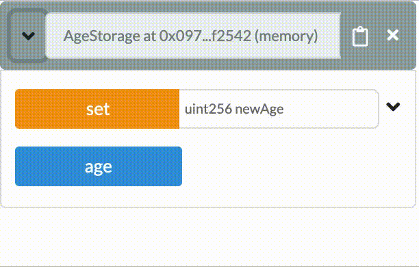

# Week 1: Getting started and the basics of smart contracts

## Course Introduction

    - Who are we

- What to expect / learning goals.
- Where to find course materials.

Manual, slides, cheatsheet,

- Environment, what do and don't we expect

* Explanation final assignment / examination.

Your grade for this course will be determined by an assignment which you can find, including the grading matrix, in Appendix 1. TODO. The assignment deadline is **deadline** and **insert handing in method**.

## Decentralized development

Development of applications generally consists of two parts, front-end development and back-end development. The front-end is what the user sees and interacts with, the back-end contains all the business logic and data storage.

Decentralized applications (or **dApps**) are applications whos back-end code runs on a decentralized network instead of centralized servers. These apps are not dependant on or controlled by a single entity. There is no single point of failure and trust can be generated through technology instead of middlemen or authority.

Although the term dApp is now almost always used to describe applications that make use of a blockchain network, this is not a necessity. Apps that use the BitTorrent protocol like Popcorn Time or uTorrent are also dApps, as they run on a decentralized p2p network.

Blockchain-based dApps are applications that communicate with a blockchain. The front-end works (largely) the same as with a centralized application but the business logic is stored in the form of **smart contracts** on a blockchain. In this course we'll discuss the specifics that come with developing these types of decentralized applications and learn how to write smart contracts.

## Smart contracts: the basics

Smart contracts are basically digital contracts that automatically enforce their content. They can be used to replace complicated structures that we currently use to guarantee that an agreement is upheld.

Because of this the middleman is no longer required.

Why trust smart contract: immutable, distributed

I

Normal contracts.

self executing contracts.

On chain.
Adress of a smart contract
send your transaction to the adress.
transaction includes gas and function / data.
contract receives transaction, uses gas to execute the function you sent.

It does not cost gas to read information. Only to change the chain.

Look at blockexplorer.

## Ethereum: the basics

Ethereum is....

Because of this it is the most used blockchain-based dApps platform.

## Solidity: the basics

Solidity is a programming language for writing smart contracts on Ethereum and other blockchain platforms.

If you have never programmed before it can be intimidating to get started. Solidity has excellent [documentation](https://solidity.readthedocs.io/) but the documentation assumes you have some basic programming experience. In this course manual the main concepts will be explained for people completely new to programming, with references to the original documentation for additional information.

### Basic contract structure

Below an example is given of a simple Solidity smart contract. Although this contract does not have a lot of practical value, it covers a lot of the core concepts of a contract written in Solidity. Let's go over it together.

```solidity
pragma solidity ^0.4.0;

contract AgeStorage {
    uint age;

    function set(uint newAge) public {
        age = newAge;
    }

    function get() public view returns (uint) {
        return age;
    }
}
```

#### Compiler Version

The first line `pragma solidity ^0.4.0;` tells the compiler what version of the compiler must be used to compile the contract. A compiler is a computer program that transforms computer code written in one programming language (the source language) into another programming language (the target language). Ethereum smart contracts are run in the Ethereum Virtual Machine (EVM). The EVM doesn't understand Solidity code, it only understands EVM code. So to deploy our smart contracts to the Ethereum network we must first make sure to compile our Solidity code into EVM code.

This line **must** be included at the very top of every contract we'll be writing. Solidity is a relatively new language and is being developed heavily. This means the language changes quite a lot and the differences between versions are substantial. Therefore, please make sure the version you specify is the same as shown on the bottom left corner of the [Solidity Documentation]

**Example**

```solidity
pragma solidity ^0.4.0;
```

- [Solidity Docs - Version Pragma]

#### Contract Declaration

To declare a contract we use the `contract` keyword followed by the name of the contract followed by two curly braces (`{}`). This name can be anything you wish.

**Example**

```solidity
contract AgeStorage {

}
```

> By convention the contract name is written in PascalCase. This means you capitalize every first letter of a word.

### Variables

In smart contracts we use variables to store and retrieve values. Take the `AgeStorage` contract above for example. It declares a variable called `age` and uses the functions `set()` and `get()` to store and retrieve the age (more on functions later [TODO: LINK TO FUNCTIONS]).

Variables must be declared along with their 'type'. A type tells the EVM what kind of value we want to store and how much memory it should allocate. This could be an integer (a number without a decimal point), a string (a piece of text), an address (belonging to a human or contract) and more.

Variables are declared with the following structure: `<variable type> <variable name> = <variable value>`. See the example below, it tells the EVM we want to store an integer (`int`) that we will call `age` and give it a value of `10`.

```solidity
int age = 10;
```

It is not required for values to be assigned a value on initialization. You can set the value at a later moment. This can be useful if you don't know the value at the moment of declaration. [TODO: LINK TO WHERE VARIABLE GETS DECLARED BUT ON ASSIGNED]

```solidity
int age;

age = 10;
```

> By convention a variable is written in camelCase. This means you capitalize every first letter of a word, except for the first word.

#### Types

As mentioned before, we need to specify a type whenever we are declaring a variable. A type tells the EVM what kind of value we want to store and how much memory is needed to store it.

Let's go over a few common types.

- [Solidity Docs - Types]

##### Boolean

The boolean type can be used to store exactly two kind of values, `true` and `false`. A boolean is indicated by the `bool` keyword.

```solidity
bool isOldEnough = true;
bool isChild = false;
```

- [Solidity Docs - Boolean]

##### Integer

An integer is a 'whole' number that has no decimal point. There are multiple types of integers, but for now we focus on `signed` and `unsigned` integers. The most important difference between these is that `signed` integer types can hold positive and negative integer values, whereas `unsigned` integers can only hold positive integer values.

If we want to declare a variable for age it is logical to take make it an `unsigned` integer as an age can never be below 0.

**Example**

```solidity
// Signed integer, can be positive and negative
int negativeAge = -10;

// Unsigned Integer, can only be positive
uint age = 10;
```

- [Solidity Docs - Integer]

##### String

The string type is used to store a piece of text. It can contain any value you like.

```solidity
string myText = "Hello World!";
```

- [Solidity Docs - String]

##### Address

The address type is used to store an ethereum account addresses. Ethereum has two types of accounts:

- Normal externally controlled accounts
- Contract accounts

**Example**

```solidity
address myAddress = 0x2bE37643B3Ecb05c4C2Ec646534b3f053565716A;
```

- [Solidity Docs - Address]
- [Ethereum Account Types]

### Comments

Comments are a great way to describe the meaning of code. In the examples before we already used some comments. The compiler will remove any comments during compilation, so it doesn't add anything to the code itself. It just helps the next person that is going to work on the contract, which probably will be you.

**Example**

```solidity
// Single-line comment, everything on this line is a comment.

/*
Multi-line comment,
everything is a comment
until you end the comment
*/

uint age = 10; // Comments can also be written on lines with code

/*
This next line is also a comment, so no variable is declared
uint age = 10;
*/
```

- [Solidity Docs - Comments]

### Functions

Functions are the executable units of code within a contract. Functions can be executed after which the code inside it will be run.

A function is declared with the following syntax:

```solidity
function <functionName>(<parameters>) <visibility> <function type> <modifiers> <return variables> {
    <function code>
}
```

A function **must** always be declared inside a contract. It is not possible to declare a function outside of a contract. So the function should be defined between the curly brackets (`{}`) of the contract.

**Example**
If we take the `AgeStorage` contract as an example.

```solidity
contract AgeStorage {
    uint age;

    function set(uint newAge) public {
        age = newAge;
    }

    function get() public view returns (uint) {
        return age;
    }
}
```

for the `set()` function:

- **`set`** is the **function name**
- **`uint newAge`** are the **parameters**
- **`public`** is the **visibility**
- the function has **no function type**
- the function has **no modifiers**
- the function has **no return variables**
- **`age = newAge;`** is the **function code**

for the `get()` function:

- **`get`** is the **function name**
- the function has **no parameters**
- **`public`** is the **visibility**
- **`view`** is the **function type**
- the function has **no modifiers**
- **`returns (uint)`** are the **return variables**
- **`return age;`** is the **function code**

So what do the `parameters`, `visibility`, `function type`, `modifiers` and `return variables` actually mean? Let's go over all of them.

> By convention a function name is written in camelCase. This means you capitalize every first letter of a word, except for the first word.

- [Solidity Docs - Functions]

#### Parameters

Parameters are the input values of a function. Let's say we want to create a function that calculates the sum of two integer values. Parameters allow us to pass the two integer values to the function so the sum can be calculated.

In the example below two parameters, `val1` and `val2` are declared as parameters for the `sum` function. Parameters are declared the same way as variables, so every parameter should have a type. In this case `uint`.

Now whenever we want to execute the `sum` function, which we are going to do in later lessons, we are required to pass the two parameters to the `sum` function.

```solidity
function sum(uint val1, uint val2) public pure returns (uint) {
    return val1 + val2;
}
```

- [Solidity Docs - Function Parameters]

#### Visibility

The visibility of a function specifies the accessibility of the function when you or another function wants to interact with it.

There are four types of visibility:

- `public`
- `external`
- `internal`
- `private`

Besides for functions, visibility is also used for state variables. TODO: STATE VARIABLES.

- [Solidity Docs - Visibility]

##### Public

Public functions and state variables are the most open visibility type. The function and variable can be accessed from inside and outside of the contract.

For public state variables, an automatic getter function is generated. A getter function is a function that simply returns the value of a variable. For the public `age` variable in the example below a `age()` function is generated that will return the value of `age`. This way we don't have to define the function to get the value of `age` ourselves.

**Example**

```solidity
contract AgeStorage {
    uint public age;

    function set(uint newAge) public {
        age = newAge;
    }
}
```



##### Private

Private functions and state variables are the most closed visibility type.

```solidity
contract AgeStorage {
    uint private age;

    function set(uint newAge) private {
        age = newAge;
    }
}
```


##### Internal

```solidity
contract AgeStorage {
    uint internal age;

    function set(uint newAge) internal {
        age = newAge;
    }
}
```


##### External

```solidity
contract AgeStorage {
    // Not allowed
    // uint external age;

    function set(uint newAge) external {
    }
}
```


#### Function Types

- [Solidity Docs - View Functions]
- [Solidity Docs - Pure Functions]

#### Modifiers

- [Solidity Docs - Function Modifiers]

#### Return Variables

- [Solidity Docs - Return Variables]

### Resources

- [Solidity Documentation]
- [Solidity Docs - Version Pragma]
- [Solidity Docs - Types]
- [Solidity Docs - Boolean]
- [Solidity Docs - Integer]
- [Solidity Docs - String]
- [Solidity Docs - Address]
- [Ethereum Account Types]
- [Solidity Docs - Comments]
- [Solidity Docs - Functions]
- [Solidity Docs - Function Parameters]
- [Solidity Docs - Return Variables]
- [Solidity Docs - Visibility]
- [Solidity Docs - Function Modifiers]
- [Solidity Docs - View Functions]
- [Solidity Docs - Pure Functions]

<!-- Internal links -->

[solidity documentation]: https://solidity.readthedocs.io/
[solidity docs - version pragma]: https://solidity.readthedocs.io/en/latest/layout-of-source-files.html#version-pragma
[solidity docs - types]: https://solidity.readthedocs.io/en/latest/types.html
[solidity docs - boolean]: https://solidity.readthedocs.io/en/latest/types.html#booleans
[solidity docs - integer]: https://solidity.readthedocs.io/en/latest/types.html#integers
[solidity docs - string]: https://solidity.readthedocs.io/en/latest/types.html#bytes-and-strings-as-arrays
[solidity docs - address]: https://solidity.readthedocs.io/en/latest/types.html#address
[ethereum account types]: https://ethereum.gitbooks.io/frontier-guide/account_types.html
[solidity docs - comments]: https://solidity.readthedocs.io/en/latest/layout-of-source-files.html#comments
[solidity docs - functions]: https://solidity.readthedocs.io/en/latest/contracts.html#functions
[solidity docs - function parameters]: https://solidity.readthedocs.io/en/latest/contracts.html#function-parameters
[solidity docs - return variables]: https://solidity.readthedocs.io/en/latest/contracts.html#return-variables
[solidity docs - visibility]: https://solidity.readthedocs.io/en/latest/contracts.html#visibility-and-getters
[solidity docs - function modifiers]: https://solidity.readthedocs.io/en/latest/contracts.html#function-modifiers
[solidity docs - view functions]: https://solidity.readthedocs.io/en/latest/contracts.html#view-functions
[solidity docs - pure functions]: https://solidity.readthedocs.io/en/latest/contracts.html#pure-functions

<!--
* How do Smart Contracts work
* Ethereum: the basics
* Solidity: the basics and a cheat sheet
  - operators (include modulo)
  - uint & int & string & typecasting
  - variables
  - structs & arrays (include public, getters)
  - hash function
  - function declarations
    - Memory storage
    - public / private
    - return values
    - modifiers (view/pure)
  - events
* Show a smart contract on remix ide

1. Making the Zombie Factory
   - Cryptozombies lesson 1 -->
