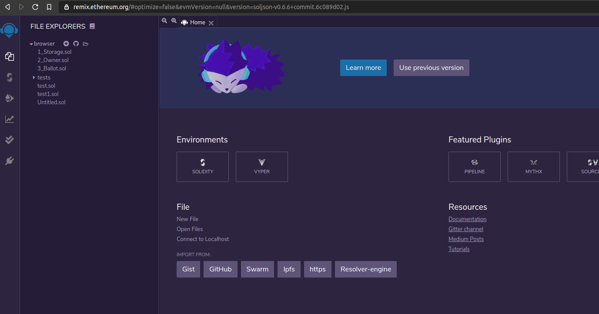

# Week 1: The Basics Of Smart Contracts

## Decentralized Development

Development of applications generally consists of two parts, front-end development and back-end development. The front-end is what the user sees and interacts with, the back-end contains all the business logic and data storage.

> When you login to a website, the username/password form and the button with the function that sends the login information would be classified as 'front-end'. The website's logic of how to validate the information once it's received and what to send back is classified as 'back-end'. How the information that is send back is then presented (think succes or error messaging) is part of the front-end.

Decentralized applications (or **dApps**) are applications whos back-end code runs on a decentralized network instead of centralized servers. These apps are not dependant on or controlled by a single entity. There is no single point of failure and trust can be generated through technology instead of middlemen or authority.

Although the term dApp is now almost always used to describe applications that make use of a blockchain network, this is not a necessity. Apps that use the BitTorrent protocol like Popcorn Time or uTorrent are also dApps, as they run on a decentralized p2p network.

Blockchain-based dApps are applications that communicate with a blockchain. The front-end works (largely) the same as with a centralized application but the business logic about what needs to happen with sent information is stored in the form of **smart contracts** on a blockchain. In this course we'll discuss the specifics that come with developing these types of decentralized applications and learn how to write smart contracts for real world use cases.

## Smart Contracts: The Basics

Smart contracts are basically digital contracts that automatically enforce their content. They can be used to replace complicated structures that we currently use to guarantee that an agreement is upheld.

Imagine you and a friend decide to bet on the outcome of a sports match. You think team A will win, your friend thinks team B will win. The loser has to pay up €100,-. If you and your friend completely trust each other you might just shake on it and leave it at that. However, what happens if you do not trust your friend to actually follow through and pay up the €100,- once team B (in your mind inevitably) loses? You might ask an impartial friend to function as a **trusted third party**. You could both give him €100,- to hand over €200,- to the winner once the match is over. Trust problem solved! Except it isn't. The trusted third party could turn out not to be as trustworthy as you hoped, be robbed or simply lose the money. Once you start worrying about this you might escalate the contstruction further, by involving a lawyer or a bank. Smart contracts fix the ever growing complexity of trust problems when agreements are made.

In a smart contract the rules for the agreement are written in executable code. Once the triggers for the agreement are activated, the consequenses are immediately and automatically carried out. Because the smart contract is written in code that is publically available on the blockchain there is **transparancy** while the individuals involved can be **anonymous**. Because the smart contract cannot be changed once on the blockchain there is **immutability**. These factors combined with the fact that the blockchain itself cannot be altered by a central authority but is **distributed** eliminate the need for a trusted third party or middleman.

> In the example of your sports bet, you and your friend could write your agreement in the form of a smart contract on the Ethereum network. This smart contract could (for example) require €100,- from both of you to check the outcome online and route €200,- directly to the winner. Trust problem solved! This time for real.

Smart contracts have many practical uses. They can be made for any agreement that follows if-this-then-that logic. The more incentive anyone has to commit fraud, the more useful the smart contract becomes. For example think about the consequences implementing smart contracts would have for voting, financial services, renting a house, insurance cases, digital identity, trading etc. Because smart contracts can be used to create a transparent, immutable, decentralized and automated proces they can also be very cost-effective as a result of their efficiency.

So smart contracts are pieces of executable code on a blockchain network. What does that mean? In the next section we'll examine where the code 'lives' and how the actual proces of triggering the smart contract works.

## Ethereum: The Basics

Next time you and that friend you don't trust decide on a bet, you might want to try using a smart contract to handle the execution. But you would need a blockchain network to put it, to ensure it has all those great immutable, decentralized and transparent qualities you want. There are different options for what blockchain to use, including setting up your own, however currently for dApps the most widely used network is Ethereum.

If you visit ethereum.org you will find that _"Ethereum is a global, open-source platform for decentralized applications."_ You can use the established Ethereum network to put your smart contract and use existing nodes to validate and update information. Because a blockchain depends on the computational power of the network these nodes are rewarded for participating through digital currency. In the Ethereum network this currency is called Ether. In next weeks material we will go into more detail about how this actually works.

Smart contracts, once put on the Ethereum network have an address. This address is used to find the correct smart contract and send the required information. Just like an e-mail address (or regular address) is used to find the person you sent information to. The information that is sent to the smart contract is called a transaction.

## Solidity: The Basics

Solidity is a programming language for writing smart contracts on Ethereum and other blockchain platforms. It is what we'll be learning during this course. This material starts with the basics and works its way up. If at any point you want to try out some code at home or in class you can navigate to [Remix IDE](https://remix.ethereum.org/). Create a new file and give it a name to get started. Remix IDE allows you to write code in your browser, it gives you error messages and feedback about your smart contract code.



If you have never programmed before it can be intimidating to get started. Solidity has excellent [documentation](https://solidity.readthedocs.io/) but the documentation assumes you have some basic programming experience. In this course manual the main concepts will be explained for people completely new to programming, with references to the original documentation for additional information.

> DO go back and forward between this material and the CryptoZombies lesson, occasionally adding Google if something is unclear.

> DO NOT read through all of the documentation and expect to understand it completely and all at once before starting the CryptoZombies material.

### Basic Contract Structure

Below an example is given of a simple Solidity smart contract. Although this contract does not have a lot of practical value, it covers a lot of the core concepts of a contract written in Solidity. Let's go over it together.

```solidity
// compiler version
pragma solidity ^0.4.0;

// contract declaration
contract CookieStorage {
    // state variable
    struct Cookie{
        string flavor;
        uint price;
        bool available;
    }

    // array
    Cookie[] public trayOfCookies;


    // function to add a cookie to the array
    function addCookie(string _flavor, uint _price, bool _available) public {
        Cookie memory c = Cookie(_flavor, _price, _available);
        trayOfCookies.push(c);
    }

    // function to get how many cookies are on the tray
    function getCookieCount() public view returns (uint _cookieCount){
        return trayOfCookies.length;
    }
}
```

### Comments

[Solidity Docs - Comments]

Comments are a great way to describe the meaning of code. The compiler will remove any comments during compilation, so it doesn't add anything to the code itself. It just helps the next person that is going to work on the contract, which probably will be you.

```solidity
// Single-line comment, everything on this line is a comment.

/*
Multi-line comment,
everything is a comment
until you end the comment
*/

uint age = 17; // Comments can also be written on lines with code

/*
This next line is also a comment, so no variable is declared
uint age = 17;
*/
```

#### Compiler Version

[Solidity Docs - Version Pragma]

The first line `pragma solidity ^0.4.0;` tells the compiler what version of the compiler must be used to compile the contract. A compiler is a computer program that transforms computer code written in one programming language (the source language) into another programming language (the target language). Ethereum smart contracts are run in the Ethereum Virtual Machine (EVM). The EVM doesn't understand Solidity code, it only understands EVM code. So to deploy our smart contracts to the Ethereum network we must first make sure to compile our Solidity code into EVM code.

This line **must** be included at the very top of every contract we'll be writing. Solidity is a relatively new language and is being developed heavily. This means the language changes quite a lot and the differences between versions are substantial. Therefore, please make sure the version you specify is the same as shown on the bottom left corner of the [Solidity Documentation]

```solidity
pragma solidity ^0.5.2;
```

#### Contract Declaration

To declare a contract we use the `contract` keyword followed by the name of the contract followed by two curly braces `{}`. This name can be anything you wish.

```solidity
contract CookieStorage {

}
```

> By convention the contract name is written in PascalCase. This means you capitalize every first letter of a word.

### Constructor (optional)

[Solidity Docs - Constructor]

Not every contract has a constructor. A constructor an optional special function that has the same name as the contract. It will get executed only one time, when the contract is first created. For now you can mostly forget about the constructor, it will come up later in more detail.

```solidity
pragma solidity ^0.5.2;

contract Cake {
  // state variable
  string flavor;

  // the constructor creates a cake the first time it is called
  constructor(string memory _flavor) public {
    flavor = _flavor;
  }

  // function that returns the flavor of the cake when called
  function getFlavor() public view returns (string memory _flavor) {
    return flavor;
  }
}
```

### Variables

In smart contracts we use variables to store and retrieve values. Take the `Cake` contract above for example. It declares a variable called `flavor` and uses the function `getFlavor()` to retrieve the flavor (more on functions later). The `CookieStorage` contract declared a variable called `Cookie` which consisted of several variables `flavor`, `price` and `available`.

> Variables can be stored in **storage** or in **memory**. In storage the variables are stored permanently on the blockchain, in memory the variables are temporary and are erased after use. More on this later.

Variables must be declared along with their 'type'. A type tells the EVM what kind of value we want to store and how much memory it should allocate. This could be an integer (a number without a decimal point), a string (a piece of text), an address (belonging to a human or contract) and more.

Variables are declared with the following structure: `<variable type> <variable name> = <variable value>`. See the example below, it tells the EVM we want to store a string (`string`) that we will call `flavor` and give it the value `chocolate`, and an integer (`int`) that we will call `price` and give it a value of `5`.

```solidity
string flavor = "chocolate";
int price = 5;
```

It is not required for values to be assigned a value on initialization. You can set the value at a later moment. This can be useful if you don't know the value at the moment of declaration.

```solidity
// this variable is declared here
string flavor;


function setFlavor() public {
    // and assigned a value here
    flavor = "chocolate";
}
```

> By convention a variable is written in camelCase. This means you capitalize every first letter of a word, except for the first word. Programmers use this to increase readability of variables. It is also recommended to keep your variable names short and descriptive. It might be tempting to name your variables x and y but other people won't be able to understand what's going on (and neither will you if you return to your code in a few months).

#### Value Types

[Solidity Docs - Types]

As mentioned before, we need to specify a type whenever we are declaring a variable. A type tells the EVM what kind of value we want to store and how much memory is needed to store it.

Let's go over a few common types.

##### Boolean

[Solidity Docs - Boolean]

The boolean type can be used to store exactly two kind of values, `true` and `false`. A boolean is indicated by the `bool` keyword.

```solidity
bool isDelicious = true;
bool hasChocolateChips = false;
bool available = true;
```

##### Integer

[Solidity Docs - Integer]

An integer is a 'whole' number that has no decimal point. There are multiple types of integers, but for now we focus on `signed` and `unsigned` integers. The most important difference between these is that `signed` integer types can hold positive and negative integer values, whereas `unsigned` integers can only hold positive integer values.

If we want to declare a variable for price it is logical to take make it an `unsigned` integer as a price can never be below 0.

```solidity
// Signed integer, can be positive and negative
int degreesCelsius = -5;

// Unsigned Integer, can only be positive
uint price = 5;
```

> Integers can also have specific sizes. The type uint256 is an unsigned integer that is 256 bits in size

##### String

[Solidity Docs - String]

The string type is used to store a piece of text. It can contain any value you like.

```solidity
string myText = "Hello World!";
string flavor = "vanilla";

// you can assign any character as a string by using double quotes.
string price = "1"
```

#### Reference Types

Reference types are special types where you have to explicitly mention where the type is stored when you use them in functions (more on this later). Storage (where state variables are stored, on the blockchain), memory (variables are only stored as long as the function call exists) or calldata (special location that we'll get into later).

##### Struct

[Solidity Docs - Struct]

Structs are for when you need to make your own type that groups multiple variables. The struct cookie groups flavor, price and availability.

```solidity
// example with assigned variables
struct Gift {
    uint price = 30;
    uint grams = 500;
    string birthdayGreeting = "Enjoy this gift, happy birthday dad!";
}

// example with unassigned variables
struct Cookie{
        string flavor;
        uint price;
        bool available;
    }
```

#### Array

[Solidity Docs - Array]

An array is a collection/list of variables. With arrays several actions can be performed, like adding to the array or removing from the array.

The type of the array is the element type with hooks `[]` behind it. The `[]` signifies that the there is an array. If the array needs to be a fixed length it can be determined between those hooks.

```solidity
// struct
struct Gift {
    uint price;
    uint grams;
    string birthdayGreeting;
}

// array of structs;
Gift[] public gifts;

// create a new Gift
Gift christmasGift = Gift(90, 1100, "Merry Christmas");

// adding to the array of structs with push
gifts.push(christmasGift);

// getting the amount of items in the array with length
gifts.length()

// array of ints
int[] arrayOfInts;

// adding to the arrayOfInts with push
arrayOfInts.push(16);
arrayOfInts.push(2);
arrayOfInts.push(2009);
arrayOfInts.push(3);

// variable len is now the same as 4
int len = arrayOfInts.length()

// array of ints with fixed length 20
int[20] fixedArrayOfInts;
```

Each item in an array has an index value that specifies its location. The index always starts at `0`. So the first array item has index `0`, the second item has index `1`, the third item has index `2` etc.

```solidity
// array of ints
int[] arrayOfInts;

// adding to the arrayOfInts with push
arrayOfInts.push(16);
arrayOfInts.push(2);
arrayOfInts.push(2009);
arrayOfInts.push(3);

// how to get 2009 from the array
arrayOfInts[2]

// how to save 2009 in the variable year
uint year = arrayOfInts[2]
```

#### Operators

Operators are a way to manipulate variables. You know most of these already. They are the regular math operators:

- x + y
- x - y
- x \* y
- x / y

Two operators you might not know are **exponential** and **modulo**.

##### Exponential

The exponential operator calculates X to the power of Y. Although this is often written as X^Y in mathematics, the operator when coding is actually \*\*.

```solidity
// Using the exponential operator to calculate bacterial growth
uint startingBacteria = 100
uint hours = 3;

int bacteriaPopulation = startingBacteria ** hours
// the variable bacteriaPopulation has now been assigned the value of 100^3 = 1000000
```

##### Modulo

Modulo is the operator that calculates the remainder of a devision. When you devide 14 by 12, the 12 fits once with 2 left over. 14 % 12 = 2. This operator is often used to determine if the result of a division is even.

```solidity
33 % 3 = 0 // no remainder
33 % 5 = 3 // some remainder
```

### Functions

Functions are what make things happen in smart contract code. Up until now we've been **declaring** variables, but not doing much with them. Functions to activate the code within them. In the example below the function gets a flavor a price and an availability as input, it creates a new cookie and it adds it to the list using .push().

Functions can be endlessly complicated. Next week we'll take a good look at them, for now its just important to note that it receives input and executes something based on that input.

```
    // state variable
    struct Cookie{
        string flavor;
        uint price;
        bool available;
    }

    // array
    Cookie[] public trayOfCookies;

    // function to add a cookie to the array
    function addCookie(string _flavor, uint _price, bool _available) public {
        // creating a new struct cookie (reference types like stuct need to explicitely mention memory, storage or calldata)
        Cookie memory c = Cookie(_flavor, _price, _available);

        // we've seen push() before
        trayOfCookies.push(c);
    }
```

### Basic Contract Structure

Look at the `CookieStorage` contract again. Hopefully you can understand what is happening in it a bit better than at the beginning of this weeks material.

```solidity
// compiler version
pragma solidity ^0.4.0;

// contract declaration
contract CookieStorage {
    // state variable of reference type struct
    struct Cookie{
        string flavor;
        uint price;
        bool available;
    }

    // array of structs
    Cookie[] public trayOfCookies;


    // function to add a cookie to the array
    function addCookie(string _flavor, uint _price, bool _available) public {

        // a new struct
        Cookie memory c = Cookie(_flavor, _price, _available);

        // .push()
        trayOfCookies.push(c);
    }

    // function to get how many cookies are on the tray
    function getCookieCount() public view returns (uint _cookieCount){

        // .length()
        return trayOfCookies.length;
    }
}
```

### Additional reading / watching

[Smart Contracts by Simply Explained on YouTube]

[Get Started With Ethereum]

<!-- Internal links -->

[solidity documentation]: https://solidity.readthedocs.io/
[solidity docs - version pragma]: https://solidity.readthedocs.io/en/latest/layout-of-source-files.html#version-pragma
[solidity docs - types]: https://solidity.readthedocs.io/en/latest/types.html
[solidity docs - boolean]: https://solidity.readthedocs.io/en/latest/types.html#booleans
[solidity docs - integer]: https://solidity.readthedocs.io/en/latest/types.html#integers
[solidity docs - string]: https://solidity.readthedocs.io/en/latest/types.html#bytes-and-strings-as-arrays
[solidity docs - comments]: https://solidity.readthedocs.io/en/latest/layout-of-source-files.html#comments
[solidity docs - structs]: https://solidity.readthedocs.io/en/v0.5.3/structure-of-a-contract.html#struct-types
[solidity docs - constructor]: https://solidity.readthedocs.io/en/v0.5.3/contracts.html#constructors
[solidity docs - array]: https://solidity.readthedocs.io/en/v0.5.3/types.html#arrays
[smart contracts by simply explained on youtube]: https://www.youtube.com/watch?v=ZE2HxTmxfrI
[get started with ethereum]: https://ethereum.org/en/what-is-ethereum/
