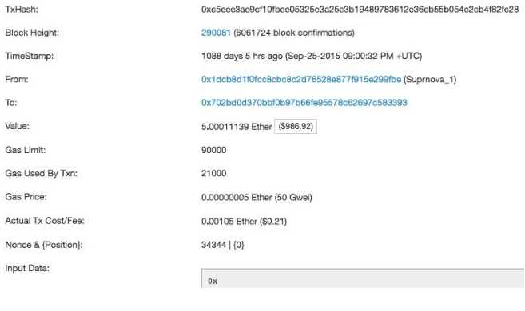

# Week 2: Expanding By Interacting With Other Contracts And Blockchains

## Smart Contracts: Usability

Last week we considered the basic uses of smart contracts and mentioned the potential they have in the real world. To build on that, this week we'll discuss several use cases.

TODO

## Ethereum: Accounts, Gas And Ether

A smart contract is a piece of code running on a blockchain network. The code contains variables and functions to allow it to execute its predetermined goal. Once the smart contract is deployed the code cannot change, this is called **immutability**, the only way to change a smart contract is to deploy a new one.

Once on the blockchain network the contract has an address. When the smart contract was created it received its own 'account' on the Ethereum network. Smart contracts own themselves. Unless specified within the code, smart contract creators have no special rights or control over the smart contract once it is created. People can also have accounts on the Ethereum network, including an address they use to identify themselves. These accounts are called Externally owned accounts (EOA's). EOA's are owned and controlled by users through wallet applications.

> Smart contracts are not controlled by anyone, they control themselves.

Everytime someone wants to use a smart contract they need to use their address to send a message with what they want to do to the address of the smart contract. This is called a **transaction**. The smart contract does not run unless it is called by a transaction from a user. A smart contract is never 'running in the background' like other appplications sometimes are. They are activated either by a transaction or by another smart contract, execute their purpose and are finished until activated again.

Every operation in Ethereum has some amount of computational cost/effort. Storing a value in a variable, adding a Zombie to your Zombie array etc. The effort to execute the operation is made by miners. Miners verify the transactions and make sure they are stored on the blockchain. The security and speed of a blockchain is dependent on the amount of miners that are willing to make the computational effort to secure it. This amount of effort is measured in **Gas**. Gas is a unit for the amount of computational effort that it will take to execute a desired operation. The bigger the operation, the more Gas it will take. Just like a car needs a certain amount of gas to get from point A to point B. The amount of Gas an operation takes can be found in gas pricing tables online.

Miners do not make the effort (measured in amount of Gas) just to participate in the fun of blockchain. Just like you do not constanly fill up your friends cars with gas just because you want to help them go on trips. Miners get rewarded for the gas they use up on operations in Ether. Ether is the cryptocurrency of the Ethereum network. The relation between Gas and Ether actually gets a bit more complicated (Ether can be turned into Gas directly) we advise you to consult the web if you want to know more specifics.

> Gas is the amount of effort that it will take to execute an operation, it is the cost of operations. Ether is a currency, it has value seperate from the Ethereum network, it can pay the cost of operations.

So to execute a smart contract, or a part of it, there needs to be a **transaction** that is sent to the smart contract's address to start it, and there needs to be payment included in this transaction. Externaly owned accounts (EOAs) have their own ether balance and are able to send transactions. The transaction needs to specify what it wants to happen. So if you want to set the age variable from 17 to 21 the transaction needs to include that it wants the smart contract on adress X to execute the setAge function with the data variable 21 and it needs to include the gas that the smart contract will need to execute that specific operation. The smart contract then receives the transaction and uses the gas to activate the specific function.



This is how interaction happens with smart contracts. If there is no activation, the smart contract code would simply sit idle without ever executing. Once the 'first' smart contract is activated by a transaction from an EOA, it can then activate different smart contracts to execute the desired operation.

> The code in smart contracts is activated by transactions or by calls from other smart contracts.

There are some simple contracts that can fit all their logic into one contract. To make more complex constructions however, while keeping the code clear and legible, the code is often split up into multiple contracts that interact with each other in some way.

## Solidity: Interaction With Other Contracts And Blockchains

There exists a world outside of your smart contracts code. This week we'll discuss several ways to interact with it.

### Special variables

In the smart contract code it is sometimes necessary to know information about the blockchain or the activating call. This information can be retrieved through special variables that are always available (global) to the smart contract.

- [Solidity Docs - Special Variables]

#### msg.data

The special variable msg.data returns the complete data of the call that activated the function. It returns the data as type bytes.

TODO add example code

#### msg.sender

The special variable msg.sender returns the address of the EOA or smart contract that called the current function. It returns the address as type address.

TODO add example code

#### tx.gasprice

The special variable tx.gasprice returns the gas price of the transaction that activated the function. It returns the gas price as type uint.

TODO add example code

#### gasleft

The special variable gasleft() returns the remaining gas. It returns the remaining gas as type uint.

TODO add example code

### Types

Last week we discussed how to use the Boolean, Integer, String and Struct types. This week we're adding address and mapping types.

#### Address

The address type is used to store an ethereum account addresses. Ethereum has two types of accounts:

- Normal externally controlled accounts
- Contract accounts

```solidity
address myAddress = 0x2bE37643B3Ecb05c4C2Ec646534b3f053565716A;
```

- [Solidity Docs - Address]
- [Ethereum Account Types]

#### Mapping

Mappings create a mapping beween a **key** and a **value**. They are often used to associate an ethereum address with a value that needs to be stored.

```solidity
contract SomeGame {
    // creating the mapping
    mapping(address => uint) public userLevel

    function currentLevel(address userAddress) public constant returns (uint) {
    returning the user level that belongs to the given user address parameter
     return userLevel[userAddress];
}
}
```

### Functions

The code of a smart contract is, once deployed, immutable. Therefore it's important that it does not allow for situations outside of the pre-determinded goals and scope of the smart contract. There are several ways to do this in solidity.

#### If-Else statements

An if-else statement is a general coding principle that is used to implement conditional logic. It can also be used without the else statement or chain multiple if-else conditions.

```solidity
function serveDrink(int memory age) public {
    if (age > 17) {
        serveAlcohol();
    }else {
        serveNonAlcoholic();
    }
}
```

#### Require

The require function is a function that checks certain global requirements to be met before allowing the code to execute. In the case of a betting contract for example there might be a requirement that all participants are part of an agreed upon array of participants. Using require, the function will not execute further if the requirement doesn't pass.

```solidity
// in function that should only be activated by the owner address

require(msg.sender == owner)
```

```solidity
// in function that should only be activated by participants

require(bettingParticipants[msg.sender]);
```

### Inheritance

Why reinvent the wheel? It is good practice to reuse code instead of retyping it in every contract. One of the ways you can do this is through inheritance.

Inheritance is a coding principle that is not specific to blockchain, ethereum or solidity, however in this section we will discuss it in the context of solidity smart contracts. First a parent contract is created with variables and functions. Then a child contract is created which can inherit aspects of the parent contract.The child can access the functionality of the parent without having to redefine the same functions. Inheritance can help you with keeping the code organized and legible.

``solidity

contract Animal {

    //TODO add something

}

````

```solidity
import "./animal.sol";

contract Cow is Animal {
    //TODO add something

}
````

When there are multiple smart contracts (like the parent and the child) these each have their own .sol file. When there are multiple files of code that need to know about each other this is done by importing the code from one smart contract into the other. This is what the `import "./animal.sol";` line does in the previous example.

[Solidity Docs - Inheritance]

#### Visibility

We already discussed private and public visibility. Once we are using inheritance and interacting with other contracts there are other types of visibility that become important. Internal and external visibility.

##### Internal

With private visability, a function or variable can only be called from within the contract it is defined in. With internal visibility it can be called from the contract it is defined in **and** contracts that inherit it.

```solidity

contract Animal {

    //TODO add function with internal visibility

}
```

```solidity
import "./animal.sol";

contract Cow is Animal {
    //TODO call function with internal visibility
}
```


##### External

A function with external visibility can only be called from a separate third party contract. It can not be called from the contract it is defined in and it is can not be called from derived contracts.

```solidity
TODO fix example
contract AgeStorage {
    // Not allowed
    // uint external age;

    function set(uint newAge) external {
    }
}
```


### Interface

One place the external visibility is relevant is in interfaces. An interface looks like a smart contract with no details, just the basic structure. There are no implemented functions and no defined variables.

```solidity

```

An interface needs a seperate contract to actually implement the functions. This sounds like unnecessary extra work but it actually....
TODO

<!-- Internal links -->

[solidity docs - address]: https://solidity.readthedocs.io/en/latest/types.html#address
[ethereum account types]: https://ethereum.gitbooks.io/frontier-guide/account_types.html
[solidity docs - special variables]: https://solidity.readthedocs.io/en/v0.4.24/units-and-global-variables.html#special-variables-and-functions
[solidity docs - inheritance]: https://solidity.readthedocs.io/en/develop/contracts.html#inheritance
