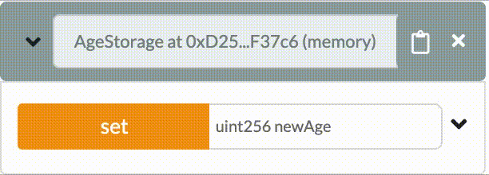

# Interacting With Other Contracts And Transactions

- [Interacting With Other Contracts And Transactions](#interacting-with-other-contracts-and-transactions)
  - [Ethereum: Accounts, Gas And Ether](#ethereum-accounts-gas-and-ether)
  - [Solidity: Interaction With Other Contracts And Blockchain](#solidity-interaction-with-other-contracts-and-blockchain)
    - [Special variables](#special-variables)
      - [msg.data](#msgdata)
      - [msg.sender](#msgsender)
      - [tx.gasprice](#txgasprice)
      - [gasleft](#gasleft)
    - [Types](#types)
      - [Address](#address)
      - [Mapping](#mapping)
    - [Functions](#functions)
      - [Multiple return variables](#multiple-return-variables)
      - [If-Else statements](#if-else-statements)
      - [For loops](#for-loops)
      - [Require](#require)
    - [Inheritance](#inheritance)
      - [Visibility Modifiers](#visibility-modifiers)
        - [Internal](#internal)
        - [External](#external)
    - [Interface](#interface)
  - [Additional reading / watching](#additional-reading--watching)

## Ethereum: Accounts, Gas And Ether

A smart contract is a piece of code running on a blockchain network. The code contains variables and functions to allow it to execute its predetermined goal. Once the smart contract is deployed the code cannot change, this is called **immutability**, the only way to change a smart contract is to deploy a new one.

Once on the blockchain network the contract has an address. When the smart contract was created it received its own 'account' on the Ethereum network. Smart contracts own themselves. Unless specified within the code, smart contract creators have no special rights or control over the smart contract once it is created. People can also have accounts on the Ethereum network, including an address they use to identify themselves. These accounts are called Externally owned accounts (EOA's). EOA's are owned and controlled by users through wallet applications.

> Smart contracts are not controlled by anyone, they control themselves.

Every time someone wants to use a smart contract they need to use their address to send a message with what they want to do to the address of the smart contract. This is called a **transaction**. The smart contract does not run unless it is called by a transaction from a user. A smart contract is never 'running in the background' like other applications sometimes are. They are activated either by a transaction or by another smart contract, execute their purpose and are finished until activated again.

Every operation in Ethereum has some amount of computational cost/effort. Storing a value in a variable, adding a Zombie to your Zombie array etc. The effort to execute the operation is made by miners. Miners verify the transactions and make sure they are stored on the blockchain. The security and speed of a blockchain is dependent on the amount of miners that are willing to make the computational effort to secure it. This amount of effort is measured in **Gas**. Gas is a unit for the amount of computational effort that it will take to execute a desired operation. The bigger the operation, the more Gas it will take. Just like a car needs a certain amount of gas to get from point A to point B. The amount of Gas an operation takes can be found in gas pricing tables online.

Miners do not make the effort (measured in amount of Gas) just to participate in the fun of blockchain. Just like you do not constantly fill up your friends cars with gas just because you want to help them go on trips. Miners get rewarded for the gas they use up on operations in Ether. Ether is the cryptocurrency of the Ethereum network. The relation between Gas and Ether actually gets a bit more complicated (Ether can be turned into Gas directly) we advise you to consult the web if you want to know more specifics. Ether is also sometimes measured in Wei. One Ether is the same as 1,000,000,000,000,000,000 Wei. Some functions use Wei as a unit instead of Ether.

> Gas is the amount of effort that it will take to execute an operation, it is the cost of operations. Ether is a currency, it has value separate from the Ethereum network, it can pay the cost of operations. Wei is the smallest unit of Ether (10^18 Wei = 1 Ether) and is sometimes used in functions.

So to execute a smart contract, or a part of it, there needs to be a **transaction** that is sent to the smart contract's address to start it, and there needs to be payment included in this transaction. Externally owned accounts (EOAs) have their own ether balance and are able to send transactions. The transaction needs to specify what it wants to happen. So if you want to set the age variable from 17 to 21 the transaction needs to include that it wants the smart contract on address X to execute the setAge function with the data variable 21 and it needs to include the gas that the smart contract will need to execute that specific operation. The smart contract then receives the transaction and uses the gas to activate the specific function.


This is how interaction happens with smart contracts. If there is no activation, the smart contract code would simply sit idle without ever executing. Once the 'first' smart contract is activated by a transaction from an EOA, it can then activate different smart contracts to execute the desired operation.

> The code in smart contracts is activated by transactions or by calls from other smart contracts.

There are some simple contracts that can fit all their logic into one contract. To make more complex constructions however, while keeping the code clear and legible, the code is often split up into multiple contracts that interact with each other in some way.

## Solidity: Interaction With Other Contracts And Blockchain

There exists a world outside of your smart contracts code. This week we'll discuss several ways to interact with it.

### Special variables

[Solidity Docs - Special Variables]

In the smart contract code it is sometimes necessary to know information about the blockchain or the activating call. This information can be retrieved through special variables that are always available (global) to the smart contract.

#### msg.data

The special variable msg.data returns the complete data of the call that activated the function. It returns the data as type bytes.

#### msg.sender

The special variable msg.sender returns the address of the EOA or smart contract that called the current function. It returns the address as type address.

#### tx.gasprice

The special variable tx.gasprice returns the gas price of the transaction that activated the function. It returns the gas price as type uint.

#### gasleft

The special variable gasleft returns the remaining gas. It returns the remaining gas as type uint.

### Types

Last week we discussed how to use the Boolean, Integer, String, Struct and Array types. This week we're adding address and mapping types.

#### Address

[Solidity Docs - Address]

The address type is used to store an ethereum account address. Although Ethereum has two types of accounts (EOA's and smart contract accounts) the addresses are both type address. Address is a value type, like boolean, string or int.

The size of an Ethereum address is 20 byte.

```solidity
address myAddress = 0x2bE37643B3Ecb05c4C2Ec646534b3f053565716A;
```

#### Mapping

[Solidity Docs - Mapping]

Mappings create a mapping between a **key** and a **value**. They are often used to associate an ethereum address with a value that needs to be stored. Mappings can _only_ be saved in **storage** never in **memory**.

Just like with public state variables, declaring a public mapping automatically creates a **getter** function that can be used to retrieve from the mapping.

```solidity
pragma solidity ^0.5.0;

contract SomeGame {
    // creating a mapping between user address and user level
    mapping(address => uint) public userLevel;

    function currentLevel(address _userAddress) public view returns (uint) {
    // returning the user level that belongs to the given user address
    // using the generated getter for the mapping
     return userLevel[_userAddress];
}
}
```

### Functions

In previous material the basic components of functions were explained. In this week some new concepts surrounding functions are explored.

#### Multiple return variables

A function can execute an operation and optionally return a value when called through using the **returns** keyword. In Solidity a function can also have multiple return variables.

#### If-Else statements

An if-else statement is a general coding principle that is used to implement conditional logic. It is used most often within functions. It can also be used without the else statement or chain multiple if-else conditions.

```solidity
function buyDessert(int _age) public {
    if (_age < 12) {
        buyCupcake();
    }else {
        buyCake();
    }
}
```

Between the hooks `()` the if statement is made. If this statement is true, the action will execute. If it is not true, the else action will execute. The code execute top to bottom, so it tries the first option and then continues. If one of the statements is true, the function will not try the other options.

```solidity
pragma solidity ^0.5.0;

contract CookieStorage {
    // define state variable string
    string chosenFlavor;

    // define struct Cookie
    struct Cookie{
        string flavor;
        uint price;
        bool available;
    }

    // create specific cookies
    Cookie c1 = Cookie("oat", 2, true);
    Cookie c2 = Cookie("double chocolate chip", 4, false);

    function chooseCookie() public {
        // use the available attribute to check availability (if statement)
        if (c1.available == true){ // c1 is available so this is true
            chosenFlavor = c1.flavor; // this code executes
        }else {
            chosenFlavor = c1.flavor; // this code never happens
        }
    }
}
```

> The difference between = and ==. A single equals sign **assigns** a value. A double equals sign **checks** if the statement is true.

#### For loops

For loops are another general coding principle. They are used to execute something in a loop. They can be very simple or complex depending on desired functionality. For loops often use a counter, which can look complicated at first.

A for loop has a beginning, a condition and an incrementing step in the form of: `for (beginning; condition; step)`. The beginning is where to begin with counting, often this is initialized at 0 with `uint i=0`. The condition is what the function checks each step. If it is true the loop continues. For example `for(uint i=0; i < 10; step)` will continue as long as the condition `i < 10` (i is smaller then 10) is true. The increment is how we change the beginning each time. If we want i to increase with 1 every loop (until the condition is no longer true) we make the increment `i++`. A for loop that loops 9 times therefore looks like this `for(uint i=0; i <10; i++)`.

```solidity
// array of ages
uint[] public ages;

// length of the array
uint arrayLength = ages.length;

// the information behind the for is the counter
for (uint i=0; i<arrayLength, i++){
    // dosomething as much times as the array is long
}

for (uint i=0; i < 100; i++){
    // dosomething until i < 100 is no longer true
}
```

#### Require

The require function is a function that checks certain requirements to be met before allowing the code to execute. It is used often within functions. In the case of a betting contract for example there might be a requirement that all participants are part of an agreed upon array of participants. Or that everyone has enough money to bet. Using require, the function will not execute further if the requirement doesn't pass.

```solidity
// in function that should only be activated by the owner address

require(msg.sender == owner)
```

```solidity
// in function that should only be activated by participants

require(bettingParticipants[msg.sender]);
```

### Inheritance

[Solidity Docs - Inheritance]

Why reinvent the wheel? It is good practice to reuse code instead of retyping it in every contract. One of the ways you can do this is through inheritance.

Inheritance is a coding principle that is not specific to blockchain, ethereum or solidity, however in this section we will discuss it in the context of solidity smart contracts. First a parent contract is created with variables and functions. Then a child contract is created which can inherit aspects of the parent contract.The child can access the functionality of the parent without having to redefine the same functions. Inheritance can help you with keeping the code organized and legible.

```solidity

contract Cake {
  // state variable
  string flavor;
  bool decoration;

  constructor() public {
      flavor = "chocolate";
      decoration = false;
   }

  function setFlavor(string memory _flavor) public {
     flavor = _flavor;
  }

  function setDecoration(bool _decoration_) public {
     flavor = _decoration;
  }
}

```

```solidity
import "./cake.sol";

contract CupCake is Cake {

// TODO: create good example
}
```

When there are multiple smart contracts (like the parent and the child) these each have their own .sol file. When there are multiple files of code that need to know about each other this is done by importing the code from one smart contract into the other. This is what the `import "./cake.sol";` line does in the previous example.

> Inheritance can be at its most useful when inheriting from contracts previously defined by other programmers. There are a lot of contracts out there that already offer functions you want in your code.

#### Visibility Modifiers

We already discussed private and public visibility. Once we are using inheritance and interacting with other contracts there are other types of visibility that become important. Internal and external visibility.

##### Internal

Previously, with the private visibility modifier, a function or variable can only be called from within the contract it is defined in. With internal visibility it can be called from the contract it is defined in **and** contracts that inherit it.

```solidity
contract AgeStorage {
    uint internal age;

    function set(uint newAge) internal {
        age = newAge;
    }
}
```


##### External

A function with external visibility can only be called from a separate third party contract. It can not be called from the contract it is defined in and it is can not be called from contracts that inherit the contract it is defined in.

```solidity
contract AgeStorage {
    // Not allowed
    // uint external age;

    function set(uint newAge) external {
    }
}
```



### Interface

[Solidity Docs - Interfaces]

One place the external visibility is relevant is in interfaces. An interface looks like a smart contract with no details, just the basic structure. There are no implemented functions and no assigned variables.

Interfaces make it possible to communicate with another existing contract on the blockchain. They create a bridge between contracts. By making an interface for a contract your code will know what functions that contract has, what to send to them and what to expect back.

```solidity
pragma solidity ^0.5.0;

//contract that we want to access
contract Level{

    // mapping of user addresses to their levels
    mapping(address => uint) userLevels;

    // function to get the level from a user
    function getUserLevel(address _userAddress) public view returns (uint) {
        return userLevels[_userAddress];
    }

}
```

```solidity
pragma solidity ^0.5.0;

// our interface
interface LevelInterface {
    function getUserLevel(address _userAddress) external view returns (uint);
}
```

```solidity
pragma solidity ^0.5.0;

// using our interface
contract MyGameExtension {

    // instance of the interface, more about this later
    LevelInterface levelInterface;

    function deservesReward() public {
        // here we use the function that we get through the interface in our own function
        uint level = levelInterface.getUserLevel(msg.sender);
        if (level > 10){
            sendReward(msg.sender);
        }
    }

    function sendReward(address _userAddress) public {
        // execute code
    }

}
```

All functions in an interface can only have visibility external, so they can only be accessed from outside of the interface. The interface is like a static piece of information about the functions that can be called from the other contract. So an interface tells your contract code what to expect from a different contract so you can use the functions in it.

> In an interface **none** of the functions have implementations. A similar concept is an abstract contract where at least one function does not have an implementation.

Of course you can also use interfaces to interact with your own contracts, or use them in other ways. What's important is that an interface for contract A contains _unimplemented_ functions that contract B calls to use the _implemented_ functions in contract A. More on interfaces later in the material.

## Additional reading / watching

[Function Visibility Summary](https://bitsofco.de/solidity-function-visibility-explained/)

<!-- Internal links -->

[solidity docs - address]: https://solidity.readthedocs.io/en/latest/types.html#address
[ethereum account types]: https://ethereum.gitbooks.io/frontier-guide/account_types.html
[solidity docs - special variables]: https://solidity.readthedocs.io/en/v0.4.24/units-and-global-variables.html#special-variables-and-functions
[solidity docs - inheritance]: https://solidity.readthedocs.io/en/develop/contracts.html#inheritance
[solidity docs - interfaces]: https://solidity.readthedocs.io/en/develop/contracts.html#interfaces
[solidity docs - mapping]: https://solidity.readthedocs.io/en/v0.5.3/types.html#mapping-types
