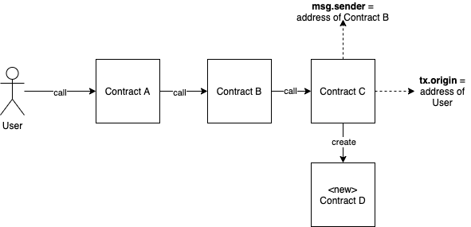

<style scoped>
table {
    height: 100%;
    width: 100%;
    font-size: 20px;
    color: red;
}
th {
    color: blue;
}

/* img[alt~="center"] {
  display: block;
  margin: 0 auto;
} */

</style>

# Decentralized Development

Interacting with Other Contracts & Transactions

---

# Topics of the day

- Accounts, Ether and gas
- Contracts and transactions
- Address and mapping types
- Conditionals (if this, than that)
- For loops

---

# Accounts, Ether and gas

---

# Accounts & addresses

> Accounts are what enable entities to interact on the network

There are two types of accounts:

- **E**xternally **O**wned **A**ccounts (EOAs) _(aka user accounts)_
- Contract Accounts

Both types have an **address** that can be used to interact with that account. The address is what identifies the user or contract on the blockchain.

> In Solidity, addresses can be stored in the `address` variable type

---

### For example:

- When you want to transfer _Ether_ to another user, you have to send it to their account address
- When you want to call a function of a contract, you'll have to specify the contract's address.

> Note: Just like user accounts (EOAs), contract accounts are also able to hold Ether. You could write a function that receives Ether and stores it in the contract account or 'wallet' (more on this later).

---

# Ether and its denominations (sub-units)

### Ether

- It's the base currency of the Ethereum network
- Its value is determined by the free market
-

Ethereum's currency is called Ether Because the value of 1 Ether is quite high (about € 436 at the time of writing), there are smaller units (denominations) .


**Attention:** Only the green ones are supported by Solidity!

---

# Gas

- Gas the unit Ethereum uses to measure _computational effort_. Just like a car needs a certain amount of fuel to drive 1km, the Ethereum network requires a certain amount of gas to complete a transaction.
- It's used to pay the miners (the nodes) for their work.
- The gas price is determined by the miners, they can set a minimum gas limit for which they are willing to process a transaction (free market once again!).
- You don't need to buy gas. The Ether in your wallet will automatically be converted into gas to pay for the transaction.

---

# Transaction example


> As you can see you can specify a **gas limit** in a transaction. This is because the gas price isn't static.

---

# Contracts & transactions

<style>
img[alt~="center"] {
  display: block;
  margin: 50px auto;
}
</style>

- A contract **can never** execute code by itself. It needs to be 'activated' by an EOA.
- However, when a contract is called by an EOA, it can make calls to other contracts.


---

## Special variables

Solidity exposes a few 'special variables' that can be used to access the concepts we've just talked about. These variables are available in **every function**.

| Variable / Function              | Description                                                             |
| -------------------------------- | ----------------------------------------------------------------------- |
| msg.data (bytes)                 | Contains the data that was sent with the transaction.                   |
| **msg.sender** (address payable) | Contains the address of the sender of the message (current call)        |
| **msg.value** (uint)             | Contains the value (Ether) that was sent with the transaction           |
| msg.sig (bytes4)                 | Contains the signature of the transaction                               |
| tx.gasprice (uint256)            | Contains the gas price of the current transaciton                       |
| gasleft() (uint)                 | Function that returns the remaining gas                                 |
| **tx.origin** (address payable)  | Contains the address of the sender of the transaction (full call chain) |
| blockhash(uint blockNumber)      | Function that returns the hash of a given block number                  |
| block.coinbase (address payable) | Contains the address of the current block miner                         |
| block.number (uint)              | Contains the current block number                                       |
| block.timestamp (uint)           | Contains the timestamp of the current block                             |
| now (uint)                       | Same as block.timestamp (alias)                                         |

---

# tx.origin vs msg.sender

- `msg.sender` returns the address of the EOA or contract that is **calling the function**
- `tx.origin` returns the address of the EOA that **initiated the transaction**
  

---

# Address type

As mentioned, addresses have their own (value) type.

```javascript
address myAddress = 0x2bE37643B3Ecb05c4C2Ec646534b3f053565716A;
```

```javascript
address functionCaller = msg.sender;
address transactionInitiator = tx.origin;
```



---

# Mapping Type

The `mapping` type creates a mapping between a **key** and a **value**.

```javascript
pragma solidity ^0.5.2;

contract SomeGame {
    // creating a mapping between user address and user level
    // here address is the key, and uint is the value
    mapping(address => uint) private userLevel;

    function setLevelForSender(uint level) public {
        userLevel[msg.sender] = level;
    }

    function getLevelForSender() public view returns (uint) {
        return userLevel[msg.sender];
    }

    function currentLevel(address _userAddress) public view returns (uint) {
        return userLevel[_userAddress];
    }
}
```

---

<!-- _class: invert -->

# Conditionals

---

# The `if` statement

A lot of the time you only want to execute a certain piece of code when a **condition** is true. This is done by using the `if` statement

```javascript
pragma solidity ^0.5.2;

contract AlcoholShop {
    function canBuyAlcohol(uint age) public pure returns (bool) {
        bool isAdult = false;

        if (age >= 18) {
            isAdult = true;
        }

        return isAdult;
    }
}
```

---

# The `else` statement

```javascript
pragma solidity ^0.5.2;

contract AlcoholShop {
    function buyAlcohol(uint age) public pure returns (string memory) {
        if (age >= 18) {
            return "beer & wine";
        }
        else {
            return "sorry mate, no drinks for u";
        }
    }
}
```

---

# Omitting the `else` statement when using `return`

```javascript
pragma solidity ^0.5.2;

contract AlcoholShop {
    function buyAlcohol(uint age) public pure returns (string memory) {
        if (age >= 18) {
            return "beer & wine";
        }
        return "sorry mate, no drinks for u";
    }
}
```

---

# Multiple `if` statements

```javascript
pragma solidity ^0.5.2;

contract AlcoholShop {
    event DebugEvent(string text);

    function buyAlcohol(uint age) public returns (string memory) {
        string memory returnText;

        if (age >= 18) {
            emit DebugEvent("RUNNING: age >= 18");
            returnText =  "beer & wine";
        }
        if (age >= 21) {
            emit DebugEvent("RUNNING: age >= 21");
            returnText = "beer, wine & liquor";
        }
        else {
            emit DebugEvent("RUNNING: else");
            returnText = "sorry mate, no drinks for u";
        }
        return returnText;
    }
}
```

---

# The `else if` statement (the wrong way)

```javascript
contract AlcoholShop {
    event DebugEvent(string text);

    function buyAlcohol(uint age) public returns (string memory) {
        string memory returnText;

        if (age >= 18) {
            emit DebugEvent("RUNNING: age >= 18");
            returnText =  "beer & wine";
        }
        else if (age >= 21) {
            // this never gets executed if age is greater or equal to 18 because of the 'else if ' statement
            emit DebugEvent("RUNNING: age >= 21");
            returnText = "beer, wine & liquor";
        }
        else {
            emit DebugEvent("RUNNING: else");
            returnText = "sorry mate, no drinks for u";
        }
        return returnText;
    }
}
```

---

# The `else if` statement (the right way)

```javascript
pragma solidity ^0.5.2;

contract AlcoholShop {
    event DebugEvent(string text);

    function buyAlcohol(uint age) public returns (string memory) {
        string memory returnText;

        if (age >= 18 && age < 21) {
            emit DebugEvent("RUNNING: age >= 18");
            returnText =  "beer & wine";
        }
        else if (age >= 21) {
            // this never gets executed if age is greater or equal to 18 because of the 'else if ' statement
            emit DebugEvent("RUNNING: age >= 21");
            returnText = "beer, wine & liquor";
        }
        else {
            emit DebugEvent("RUNNING: else");
            returnText = "sorry mate, no drinks for u";
        }
        return returnText;
    }
}
```

---

# For Loops

Sometimes you want to execute a piece of code multiple times. Instead of copying the code over and over again, you can use a `for` loop.

```javascript
pragma solidity ^0.5.2;

contract LoopRunner {
    function runLoop(uint amountOfTimes) public pure returns (uint) {
        uint loopCounter = 0;

        for (uint i = 0; i < amountOfTimes; i++) {
            loopCounter++;
            // same as: loopCounter = loopCounter + 1;
        }
        return loopCounter;
    }
}

```

---

# Looping through arrays

You can also use for loops to loop through an array:

```javascript
pragma solidity ^0.4.11;

contract AverageCalculator {
    uint[] numbers = [2, 30, 54, 65];
    event LoopEvent(uint number);

    function getAvegrage() public returns (uint) {
        uint total = 0;

        for (uint i = 0; i < numbers.length; i++) {
            emit LoopEvent(numbers[i]);
            total += numbers[i];
        }

        return (total / numbers.length);
    }
}
```

---

# Putting it together

```javascript
pragma solidity 0.4.25;

contract Loop {

    struct StudentStruct {
        uint grade;
    }

    mapping(address => StudentStruct) public studentStructs;
    address [] public studentList;

    event LogStudentGrade(address student, uint studentGrade);

    function appendStudentGrade(address student, uint studentGrade) public {
        studentList.push(student);
        studentStructs[student].grade = studentGrade;
    }

    function getStudentCount() public view returns(uint count) {
        return studentList.length;
    }

    function studentLoop() public {

        // WARN: This unbounded for loop is an anti-pattern

        for (uint i=0; i<studentList.length; i++) {
            emit LogStudentGrade(studentList[i], studentStructs[studentList[i]].grade);
        }
    }
}
```

---

<!-- _class: invert -->

# Any questions?
