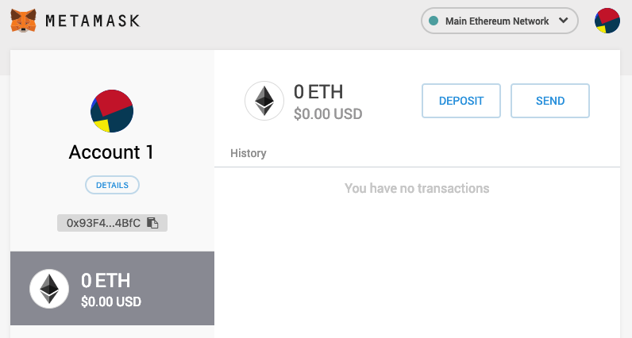

# Week 5: Wallets And Moving Money

## Smart Contracts

- Cryptocurrencies //TODO

## Ethereum

On Ethereum there are different types of account. Externally owned accounts (EOAs) for users of the network and contract accounts for smart contracts. Both these types of account can store money in the form of the Ethereum cryptocurrency **Ether** (ETH).

Previously we've discussed how ETH is used to pay for Gas to execute operations. Since ETH is a cryptocurrency it can also be transferred as a form of payment separate from the payment needed for miners to validate the network. When a money transfer is a part of a smart contract use case, sending and receiving ETH between accounts is a way to implement this.

Although an account can store some ETH on its own most EOA and smart contract accounts use a **wallet**. A wallet is a type of smart contract specifically for receiving, storing and spending money. It has its own address and keys and needs to be deployed to the ethereum network by an account.

Just like other smart contracts it costs Gas to create a wallet (as it costs Gas to deploy a smart contract). The owner of the wallet then uses it to store their ETH and, when needed, spend or receive it.

> Remember, a wallet _is_ a smart contract but can also be _used_ by other smart contracts.

A wallet works largely the same for EOAs as it does for smart contracts. Although smart contract wallets often have more functionality.

TODO: Software, hardware wallet https://blog.gnosis.pm/breaking-down-ethereum-wallets-options-2162b41477d7

TODO: Keys and wallets, restoring, etc.

## MetaMask

MetaMask is a browser extension wallet that runs in your browser (Chrome, Firefox, Opera, or Brave Browser). It is easy to use and convenient for testing, as it is able to connect to a variety of Ethereum nodes and test blockchains. MetaMask is a web-based wallet. Eventually we are going to use MetaMask to deploy and call our contracts (in week 7), it is our gateway to the Ethereum network. For now however, we are setting up a wallet.

> During the setup you will be presented with a "Secret Backup Phrase". This phrase consists of twelve words and allows you to recover your account when you lost your password or want to use the same account on a different computer. Your secret backup phrase makes it easy to back up and restore your account. Be sure to write it down and store it in a secure place. If your backup phrase gets compromised your account is compromised forever, no way back.

### Getting started with MetaMask

Download and install the MetaMask extension from the Chrome webstore [here](https://chrome.google.com/webstore/detail/metamask/nkbihfbeogaeaoehlefnkodbefgpgknn) and follow the installation steps.

Once you are done with all the steps you’ll be able to see the details of your Ethereum account, as shown in the image below. Congratulations! You have set up your first Ethereum wallet.



> Your account page shows the name of your account ("Account 1" by default), an Ethereum address (0x93F4...4BfC in the example), and a colorful icon to help you visually distinguish this account from other accounts. At the top of the account page, you can see which Ethereum network you are currently working on ("Main Ethereum Network" in the example). Later on we'll get some Gas and learn how to deploy a contract.

## Solidity

To move around money using smart contracts the smart contracts themselves need to be created for this purpose. There need to be functions to pay, check and withdraw money from a contract. There are default aspects of solidity to assist with this.

### Payable Modifier

The payable modifier allows functions or addresses to receive Ether.

#### Payable Functions

If we think back to the betting example, a payable function could be used to collect a certain amount of money for participants to be allowed to participate.

A function can simply be payable without additional context. But often it is combined with requirements, checks or restrictions. For example the execution of a payable function can be dependent on payment. To do this you can use the require function to require a certain value to be sent with the activating call. So far we have mostly used the call data to check the msg.sender, but there is a lot of other available information.

```solidity
contract BettingContract {


    function payToEnter() external payable {
    // remember the special variable 'msg.value'
    require(msg.value == 0.30 ether);
    addToParticipants(msg.sender)
    }
}
```

#### Payable Addresses

[Solidity Docs - Address](https://solidity.readthedocs.io/en/develop/types.html#address)

An address with the payable modifier is the same as the address type we learned about earlier. The only difference is that a payable address can be sent Ether, and a regular address cannot. A regular address can be converted to a payable address.

To enable Ether payment, the payable address has extra functions available.

##### address.transfer(amount)

The .transfer() function allows you to send an amount to an address of your choosing. The amount is in Wei.

> Remember, Wei is the smallest amount of Ether. 1 Ether = 10^18 Wei. Wei is stored in type uint256

```solidity
// transfer to address
customer.transfer(0.100);

// withdraw money yourself
function withdraw() external onlyOwner {
    msg.sender.transfer(0.100);
}

// allow others to withdraw money
function withdraw() external {
    msg.sender.transfer(0.100);
}
```

##### address.balance

To see the balance of an account every account has a .balance member. This member returns the balance in Wei of the address.

```solidity

address payable anAddress = address(.....)

uint256 amountOfWei = anAddress.balance

```

#### Using patterns

Implementing code to send money yourself can be a risk. That is why money transfer is often done using the 'withdrawal' pattern. A pattern is an often reused way of doing something in code.

```solidity
pragma solidity ^0.5.0;

contract WithdrawalContract {
    address public richest;
    uint public mostSent;

    mapping (address => uint) pendingWithdrawals;

    constructor() public payable {
        richest = msg.sender;
        mostSent = msg.value;
    }

    function becomeRichest() public payable returns (bool) {
        if (msg.value > mostSent) {
            pendingWithdrawals[richest] += msg.value;
            richest = msg.sender;
            mostSent = msg.value;
            return true;
        } else {
            return false;
        }
    }

    function withdraw() public {
        uint amount = pendingWithdrawals[msg.sender];
        // Remember to zero the pending refund before
        // sending to prevent re-entrancy attacks
        pendingWithdrawals[msg.sender] = 0;
        msg.sender.transfer(amount);
    }
}
```

Read about the withdrawal pattern and other common patterns in the [documentation](https://solidity.readthedocs.io/en/v0.5.3/common-patterns.html#common-patterns)
